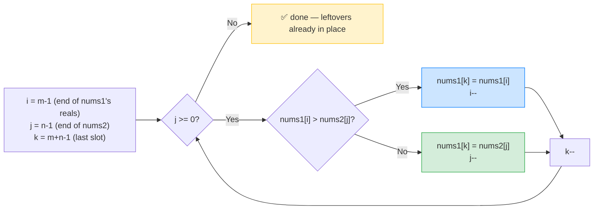

# 🔀 Merge Sorted Array (LeetCode #88) — Complete Study Notes

> Notes for becoming a strong software engineer. Easy language, the problem explained simply, brute force → your solution → optimal, and an interview *script*.
> Your solution is **correct** — and we'll add the O(1)-space version interviewers ask for. ✅

---

## 🤔 1. What Is This Question Actually Asking? (read this first)

This problem has a **confusing setup**, so let's decode it:

- `nums1` is an array of length **m + n**, but only the **first `m`** elements are *real* numbers. The **last `n`** slots are filled with `0` — they're just **empty placeholders** (padding).
- `nums2` has **`n`** real numbers.
- Both `nums1` (its first `m`) and `nums2` are **already sorted**.
- Your job: **merge `nums2` into `nums1`** so that all `m + n` slots of `nums1` become **one sorted array.** Modify `nums1` **in place** (don't return anything).

> 🧩 Plain words: *"`nums1` has some sorted numbers, plus empty room at the end. `nums2` has more sorted numbers. Pour `nums2` into `nums1`'s empty room and end up with everything sorted — inside `nums1`."*

**Concrete example:**
```
nums1 = [1, 2, 3, 0, 0, 0],  m = 3     ← first 3 are real, [0,0,0] is padding
nums2 = [2, 5, 6],           n = 3

After merging, nums1 = [1, 2, 2, 3, 5, 6]   ✅  (all 6 slots, sorted)
```

> 💡 **Why the weird padding?** `nums1` is given extra space at the end **on purpose** — so you can fit `nums2`'s elements *inside* `nums1` without creating a new array. That hint is the whole point: the problem wants an **in-place merge.**

---

## 🐢 2. Brute Force First (uses the built-in `.sort()`)

The naive idea: ignore that they're sorted — just **dump `nums2` into the empty slots, then sort the whole thing.**
```javascript
var merge = function(nums1, m, nums2, n) {
    for (let i = 0; i < n; i++) {
        nums1[m + i] = nums2[i];   // fill the padding with nums2's values
    }
    nums1.sort((a, b) => a - b);   // sort everything (built-in)
};
```
> ⚠️ This works and is short, but sorting costs **O((m+n) log(m+n)) time** — it **throws away** the fact that both arrays are already sorted. That waste is what you improve on. (This is also the only "built-in function" solution — `.sort()`.)

> 🎯 Say out loud: *"The quick way is to copy nums2 in and sort — O((m+n) log(m+n)). But since both are already sorted, I can merge them in linear time instead."*

---

## ✅ 3. Your Solution (merge into a copy — O(m+n) time)

```javascript
var merge = function(nums1, m, nums2, n) {
    let i = 0, j = 0, pointer = 0;
    let ans = [];

    // Merge the two sorted arrays into `ans`, always taking the smaller front element.
    while (i < m && j < n) {
        if (nums1[i] < nums2[j]) { ans[pointer] = nums1[i]; i++; }
        else                     { ans[pointer] = nums2[j]; j++; }
        pointer++;
    }
    // Copy any leftovers (only one of these runs).
    while (i < m) { ans[pointer] = nums1[i]; pointer++; i++; }
    while (j < n) { ans[pointer] = nums2[j]; pointer++; j++; }

    // Write the merged result back into nums1.
    for (let k = 0; k < n + m; k++) nums1[k] = ans[k];
};
```

**This is correct and a good instinct** — it's the **classic "merge two sorted arrays" step** (the merge from merge sort). You compare the front of each array, take the smaller, and advance. It correctly **uses the sortedness**, so it's **O(m + n) time** — much better than sorting.

> ✅ It also handles the edge cases cleanly: `m=0` (copy all of nums2), `n=0` (copy all of nums1), both empty (nothing happens).

> ⚠️ The one thing to improve: it builds a **separate `ans` array**, so it uses **O(m + n) extra space.** The problem gives `nums1` padding precisely so you can avoid that — see the optimal below. (This is almost always the interviewer's follow-up: *"can you do it without extra space?"*)

---

## ⭐ 4. The Optimal — Merge From the BACK (in-place, O(1) space)

The clever trick: **fill `nums1` from the end**, placing the **largest** elements first. Because the empty slots are at the **back**, you never overwrite a value you still need to read.

```javascript
var merge = function(nums1, m, nums2, n) {
    let i = m - 1;        // last REAL element in nums1
    let j = n - 1;        // last element in nums2
    let k = m + n - 1;    // last slot in nums1 (where we write)

    while (j >= 0) {      // keep going while nums2 still has elements
        // Put the BIGGER of the two at the back, then step that pointer back.
        if (i >= 0 && nums1[i] > nums2[j]) {
            nums1[k] = nums1[i];
            i--;
        } else {
            nums1[k] = nums2[j];
            j--;
        }
        k--;
    }
    // If nums1 still has leftovers, they're already in the right place — done.
};
```

> ⚡ **Complexity:** **O(m + n) time**, **O(1) space** (no extra array — we reuse nums1's padding). This is the answer interviewers want.

> 💡 **Why fill from the back works:** the write pointer `k` always stays **ahead of** the read pointer `i` (`k ≥ i` at all times), so we never overwrite an `nums1` element before we've read it. Filling from the front would clobber unread values — that's exactly why your version needed a separate array, and why going backward avoids it.

> 💡 **Why `while (j >= 0)`?** Once `nums2` is fully placed, any remaining `nums1` elements are *already* sorted and *already* at the front in the correct spots — so there's nothing left to do.

---

## 🔍 5. How the Optimal Works — Step by Step

Trace `nums1 = [1,2,3,0,0,0]`, m=3, `nums2 = [2,5,6]`, n=3.  Start: `i=2, j=2, k=5`.

```
              nums1[i] vs nums2[j]    bigger → write at k        nums1
k=5: i=2,j=2:   3   vs   6            6 → nums1[5]=6, j=1, k=4    [1,2,3,0,0,6]
k=4: i=2,j=1:   3   vs   5            5 → nums1[4]=5, j=0, k=3    [1,2,3,0,5,6]
k=3: i=2,j=0:   3   vs   2            3 → nums1[3]=3, i=1, k=2    [1,2,3,3,5,6]
k=2: i=1,j=0:   2   vs   2            2 → nums1[2]=2, j=-1, k=1   [1,2,2,3,5,6]
j = -1 → stop. nums1[0..1] = [1,2] already correct.
result: [1,2,2,3,5,6]  ✅
```



> 💡 Three pointers, all moving **backward**: two readers (`i`, `j`) at the ends of the two arrays, one writer (`k`) filling from the last slot. Always write the larger of the two reads.

---

## 🎤 6. The Interview Script — How to Talk Through It

Narrate in this order — restate the confusing setup clearly, brute force, then optimise:

**① Restate (show you decoded the setup):**
> "nums1 has m real elements plus n empty slots at the end, and nums2 has n elements. Both are sorted. I need to merge them so nums1 holds all m+n in sorted order, in place."

**② Brute force first:**
> "The simple way is to copy nums2 into the empty slots and sort the whole array — O((m+n) log(m+n)). But that ignores that both are already sorted."

**③ Better — merge in linear time:**
> "Since they're sorted, I can merge by comparing the fronts and taking the smaller — O(m+n) time. The catch is doing it in place without a second array."

**④ The key insight → optimal:**
> "The trick is to fill nums1 from the *back*, placing the largest elements first. The empty slots are at the end, so writing backward never overwrites an element I still need to read. Three pointers — two reading from the ends, one writing from the last slot."

**⑤ Complexity:**
> "O(m+n) time and O(1) space — no extra array, since I reuse nums1's padding."

**⑥ Code it, narrating; then verify with a trace:**
> "i and j start at the last real elements, k at the last slot. While nums2 has elements, I write the bigger of nums1[i] and nums2[j] at k and step that pointer back. Trace [1,2,3,0,0,0] + [2,5,6]: place 6, 5, then 3, then 2 — giving [1,2,2,3,5,6]."

**⑦ Mention the leftover detail:**
> "I loop while j ≥ 0, because once nums2 is placed, any remaining nums1 elements are already sorted and in position."

> 🎯 **Why this flow wins:** decode the setup → brute force → linear merge → in-place insight → complexity → verify. Explaining *why backward works* (no overwriting) is the moment that proves you truly understand it.

---

## 🟢 7. Likely Follow-up Questions (and answers)

> **Q: "Why merge from the back instead of the front?"**
> A: "The empty space is at the end of nums1. If I merged from the front, I'd overwrite nums1 elements I haven't read yet, so I'd need a copy. From the back, the write position is always at or ahead of the read position, so it's safe in place."

> **Q: "Why is your O(m+n) merge better than sorting?"**
> A: "Sorting is O((m+n) log(m+n)) and ignores the existing order. A merge uses the sortedness to do it in linear O(m+n) time."

> **Q: "What's the space difference between the two merge versions?"**
> A: "Merging into a separate array is O(m+n) space; merging from the back reuses nums1's padding, so it's O(1) space. Same time, better space."

> **Q: "Why loop only while j ≥ 0, not while both have elements?"**
> A: "If nums1's elements run out first, the rest of nums2 still needs placing. If nums2 runs out first, nums1's remaining elements are already in their correct sorted positions — so I only need to continue while nums2 has elements."

---

## 💎 8. Impressive Words & Phrases

| Instead of saying... | Say this 💪 |
|---|---|
| "Combine two sorted lists" | "The **merge step** (as in merge sort)" |
| "Fill from the end" | "**Backward / reverse iteration**" |
| "Don't use a new array" | "**In-place**, O(1) auxiliary space" |
| "Three index variables" | "**Three pointers** (two read, one write)" |
| "The empty zeros" | "The **padding / placeholder slots**" |
| "Take the bigger one" | "Place the **larger of the two tails**" |
| "Copy and sort" | "The **O((m+n) log(m+n))** sort approach" |
| "Already in the right spot" | "Remaining elements are **already in position**" |

**Power vocabulary:** *merge step, two-way merge, in-place, O(1) auxiliary space, backward iteration, three-pointer technique, placeholder/padding, exploiting sortedness, write pointer ahead of read pointer, leftover invariant.*

> 🌶️ Bonus flex — **"backward fill avoids the overwrite problem":** *"The elegant insight is that merging in place is only safe from the back. Writing from the last slot, the write pointer never catches up to an unread element — so I get O(1) space. Front-to-back would require a buffer. Recognising that the free space is at the end and exploiting it is the key."* This shows you understand *why* the in-place trick works, not just the steps.

---

## ⏱️ 9. Quick Revision (read 5 min before interview)

> **Problem:** `nums1` = m real + n empty slots; `nums2` = n elements; both sorted. Merge into `nums1`, sorted, **in place.**
>
> **Padding hint:** the empty slots at the end of `nums1` mean the intended answer is **in-place, O(1) space.**
>
> **Brute force:** copy nums2 in + `.sort()` → **O((m+n) log(m+n))** (ignores sortedness).
>
> **Merge into copy (your version):** compare fronts, take smaller → **O(m+n) time, O(m+n) space.** Correct, but uses a buffer.
>
> **⭐ Optimal (merge from back):** `i=m-1, j=n-1, k=m+n-1`; while `j>=0`, write `max(nums1[i], nums2[j])` at `k`, step that pointer back. **O(m+n) time, O(1) space.**
>
> **Why backward:** write pointer stays ahead of read pointer → never overwrites unread data.
>
> **Loop while `j>=0`:** leftover nums1 elements are already in place.
>
> **Golden line:** *"Both arrays are sorted and nums1 has space at the end, so I merge from the back with three pointers — writing the larger of the two tails into the last slot. The write pointer stays ahead of the reads, so it's in-place with O(1) space and O(m+n) time."*

---

### ✅ Practice checklist
- [ ] Re-read until the m/n/padding setup is crystal clear
- [ ] Write the brute-force copy-and-sort version (the built-in `.sort()`)
- [ ] Re-solve your merge-into-copy version from scratch
- [ ] Learn the **merge-from-back** in-place version (the optimal)
- [ ] Trace [1,2,3,0,0,0] + [2,5,6] backward on paper
- [ ] Explain *why backward filling is safe in place* — out loud
- [ ] Practise the interview script (decode → brute → merge → in-place)

Your solution is correct and uses the right merge idea — now learn the backward in-place version, since "do it with O(1) space" is the follow-up you'll almost always get. 🚀
