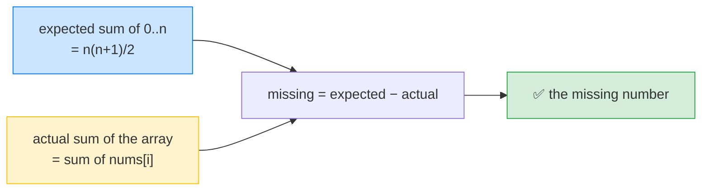

# 🔍 Missing Number (LeetCode #268) — Complete Study Notes

> Notes for becoming a strong software engineer. Easy language, the problem explained simply, brute force → optimal, and an interview *script*.
> Your solution is **correct and optimal** — the elegant Gauss-sum trick. ✅

---

## 🤔 1. What Is This Question Asking? (read this first)

You're given an array of **`n` distinct numbers**, all taken from the range **`0, 1, 2, ..., n`** (that's **`n + 1`** possible numbers). Since the array holds only `n` of them, **exactly one number is missing.** Find it.

**Example:**
```
Input:  nums = [3, 0, 1]     (n = 3, so the full range is 0,1,2,3)
Output: 2
        (the array has 0, 1, 3 — so 2 is the missing one)
```

> 🧩 Plain words: *"The numbers 0 up to n should all be there, but one is missing from the array. Which one?"*

> 💡 **The key detail:** the range is `[0, n]` (inclusive) — that's `n+1` numbers — but the array has only `n` numbers. So one of them must be missing. (`n` is just the array's length.)

---

## 🐢 2. Brute Force First

**Naive idea:** for each candidate number `0..n`, search the whole array to see if it's there. The one not found is missing.
```javascript
var missingNumber = function(nums) {
    for (let candidate = 0; candidate <= nums.length; candidate++) {
        if (!nums.includes(candidate)) return candidate; // O(n) search each time
    }
};
```
> ⚠️ `includes` scans the array each time → **O(n²)** total. Correct, but slow.

**Slightly better:** put all numbers in a **Set**, then check `0..n`:
```javascript
var missingNumber = function(nums) {
    const seen = new Set(nums);
    for (let i = 0; i <= nums.length; i++) {
        if (!seen.has(i)) return i; // O(1) lookups → O(n) total
    }
};
```
> ⚠️ This is **O(n) time but O(n) space** (the Set). The challenge is to do it with **O(1) space** — which your solution does.

> 🎯 Say out loud: *"Naively I'd check each number against the array — O(n²). A Set makes it O(n) time but O(n) space. I can do O(n) time and O(1) space with a math trick."*

---

## ✅ 3. Your Optimal Solution (Gauss Sum)

```javascript
var missingNumber = function(nums) {
    const n = nums.length;
    const totalSum = n * (n + 1) / 2;   // expected sum of 0+1+2+...+n (Gauss formula)
    let currentSum = 0;
    for (let i = 0; i < n; i++) {
        currentSum += nums[i];           // actual sum of the array
    }
    return totalSum - currentSum;        // the gap is the missing number
};
```

**This is the textbook optimal answer.** The idea uses a famous math formula:

> 💡 **Gauss's formula:** the sum of `0 + 1 + 2 + ... + n` equals **`n × (n + 1) / 2`**. So I compute the **expected** sum of the full range, subtract the **actual** sum of the array, and the difference is the missing number — because every number that *is* present cancels out, leaving only the missing one.

> ⚡ **Complexity:** **O(n) time** (one pass to sum), **O(1) space** (just two numbers). Optimal.

> 💡 Small note: `n * (n + 1)` is always even (two consecutive integers), so the result is always a whole number — your `Math.floor` works but isn't needed.

---

## 🔍 4. How It Works — Step by Step

The whole trick: **expected sum − actual sum = missing number.**

Trace `nums = [3, 0, 1]`, so `n = 3`:
```
Full range 0..3:   0  1  2  3      expected sum = 3×4/2 = 6
Array [3,0,1]:     0  1  _  3      actual sum   = 3+0+1 = 4
                         ↑
                   missing = 6 − 4 = 2   ✅
```



> 💡 Why it works: the expected sum includes **every** number `0..n`. The actual sum includes every number **except** the missing one. Subtract, and all the present numbers cancel — the leftover is exactly the missing one.

---

## 🔧 5. Built-In Function?

Your loop that computes `currentSum` can be written in one line with the built-in **`.reduce()`** (same algorithm, just shorter):
```javascript
var missingNumber = function(nums) {
    const n = nums.length;
    const totalSum = n * (n + 1) / 2;
    const currentSum = nums.reduce((sum, x) => sum + x, 0); // built-in sum
    return totalSum - currentSum;
};
```
> 💡 This is **your exact approach** — just using `.reduce()` to add up the array instead of a `for` loop. Same O(n) time, O(1) space. Good to know the concise form, though writing the loop in an interview is perfectly fine too.

---

## 🎤 6. The Interview Script — How to Talk Through It

Narrate in this order — brute force first, then the math trick:

**① Restate:**
> "I have an array of n distinct numbers from the range 0 to n, so one number in that range is missing, and I need to find it."

**② Brute force first:**
> "The naive way is to check each number 0 to n against the array — O(n²). A hash set makes lookups O(1), giving O(n) time but O(n) space."

**③ Propose the optimal (the insight):**
> "I can do O(n) time and O(1) space with a math trick. The sum of 0 to n is n times n-plus-1 over 2 by Gauss's formula. I subtract the array's actual sum from that expected sum — the difference is the missing number, because every present number cancels out."

**④ Complexity:**
> "One pass to sum the array — O(n) time, O(1) space, no extra data structure."

**⑤ Code it, narrating; then verify:**
> "Expected sum for [3,0,1] is 3 times 4 over 2, which is 6. Actual sum is 4. So missing is 6 minus 4, which is 2. Correct — 2 is the one not in the array."

**⑥ Mention the trade-off (shows depth):**
> "One caveat: summing could overflow for a very large n. If that's a concern, I'd use the XOR approach instead, which avoids large sums."

> 🎯 **Why this flow wins:** brute force → complexity → the math insight → code → verify → the overflow caveat. Proactively raising the overflow trade-off shows you think beyond just "it works."

---

## 🟢 7. Likely Follow-up Questions (and answers)

> **Q: "Why does subtracting the sums give the missing number?"**
> A: "The expected sum has every number 0 to n. The actual sum has all of them except the missing one. So expected minus actual cancels every present number and leaves exactly the missing one."

> **Q: "What if `n` is huge and the sum overflows?"**
> A: "Then I'd use the **XOR** approach: XOR all the indices 0 to n together with all the array values. Every present number appears twice and cancels (since x XOR x = 0), leaving only the missing number. It avoids large sums entirely — O(n) time, O(1) space."
> ```javascript
> let xor = nums.length;
> for (let i = 0; i < nums.length; i++) xor ^= i ^ nums[i];
> return xor;
> ```

> **Q: "Why is the Gauss-sum better than sorting?"**
> A: "Sorting to find the gap is O(n log n). The sum trick is a single O(n) pass with O(1) space — no sorting needed."

> **Q: "Could you also do it by sorting?"**
> A: "Yes — sort the array, then scan for the first index where `nums[i] !== i`. But that's O(n log n), slower than the sum or XOR approaches."

---

## 💎 8. Impressive Words & Phrases

| Instead of saying... | Say this 💪 |
|---|---|
| "Add 0 to n formula" | "**Gauss's formula** / arithmetic series sum" |
| "Expected total" | "The **expected sum** of the complete range" |
| "Subtract to find it" | "The difference reveals the missing element via **cancellation**" |
| "No extra array" | "**O(1) auxiliary space**" |
| "Go through once" | "A **single pass**, O(n)" |
| "XOR trick" | "**Bitwise XOR** (self-cancelling pairs)" |
| "Might get too big" | "Potential **integer overflow** (use XOR)" |

**Power vocabulary:** *Gauss's formula, arithmetic series, expected vs actual sum, cancellation, O(1) auxiliary space, single pass, bitwise XOR, self-cancelling pairs, integer overflow, mathematical insight.*

> 🌶️ Bonus flex — **"two O(1)-space approaches: sum and XOR":** *"There are two elegant O(1)-space solutions: the Gauss sum, where expected minus actual cancels to the missing number, and XOR, where pairing every index with every value cancels all present numbers. XOR is nice because it avoids any overflow from large sums. Knowing both, and when to prefer XOR, shows I understand the trade-offs."* Offering both and the reason to choose XOR signals real depth.

---

## ⏱️ 9. Quick Revision (read 5 min before interview)

> **Problem:** array of `n` distinct numbers from range `[0, n]` (n+1 values) → one is **missing**, find it.
>
> **Brute force:** check each 0..n in the array → **O(n²)**; or a **Set** → O(n) time, O(n) space.
>
> **Optimal (Gauss sum):** `expected = n(n+1)/2`; `actual = sum(nums)`; **missing = expected − actual**. **O(n) time, O(1) space.**
>
> **Why it works:** present numbers cancel; only the missing one remains.
>
> **Built-in:** `nums.reduce((s,x)=>s+x, 0)` for the sum (same approach).
>
> **Overflow caveat → XOR:** XOR all indices 0..n with all values; pairs cancel (`x^x=0`), leaving the missing number. No big sums.
>
> **Golden line:** *"The numbers 0 to n have a known sum, n times n-plus-1 over 2. I subtract the array's actual sum from that — every present number cancels, leaving the missing one. O(n) time, O(1) space. XOR is the overflow-safe alternative."*

---

### ✅ Practice checklist
- [ ] Re-solve your Gauss-sum version from scratch
- [ ] Write the brute-force Set version and explain its O(n) space
- [ ] Trace [3,0,1]: expected 6, actual 4, missing 2
- [ ] Explain *why* subtracting sums works (cancellation)
- [ ] Learn the XOR alternative and *why* it avoids overflow
- [ ] Practise the interview script **out loud** (brute → sum trick → overflow caveat)

Your solution is already optimal — now nail the brute-force-first narration and mention the XOR/overflow trade-off to show range. 🚀
