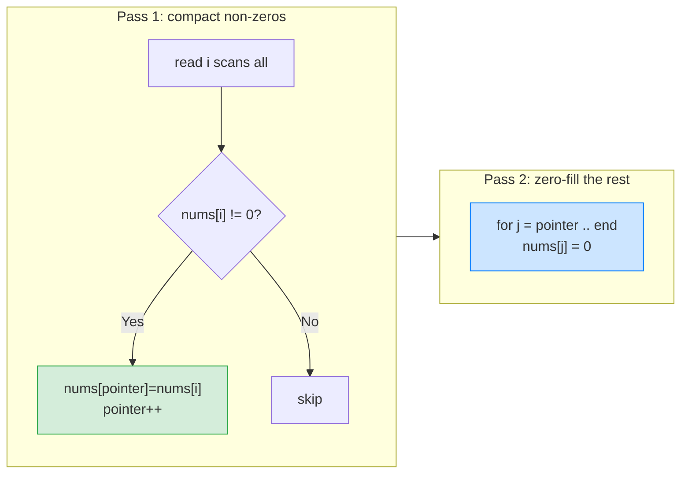

# 0️⃣ Move Zeroes (LeetCode #283) — Complete Study Notes

> Notes for becoming a strong software engineer. Easy language, the problem explained simply, brute force → optimal, and an interview *script*.
> Your solution is **correct and optimal**. ✅

---

## 🤔 1. What Is This Question Asking? (quick)

You're given an array `nums`. Move **all the `0`s to the end**, while keeping the **relative order** of the **non-zero** numbers the same. Do it **in place** (no new array), don't return anything.

**Example:**
```
Input:  nums = [0, 1, 0, 3, 12]
Output: nums = [1, 3, 12, 0, 0]
        (non-zeros 1,3,12 keep their order; the two 0s go to the end)
```

> 🧹 Plain words: *"Push all the zeros to the back, but don't shuffle the other numbers — they must stay in the same order."*

> 💡 This is basically **Remove Element (#27) with `val = 0`** — but instead of just returning a count, you **fill the leftover slots with zeros.** Same read/write two-pointer idea.

---

## 🐢 2. Brute Force First (uses extra space)

The naive idea: collect all the non-zero numbers into a **new array**, then **pad** the rest with zeros, and copy back.
```javascript
var moveZeroes = function(nums) {
    const result = [];
    for (const x of nums) if (x !== 0) result.push(x); // non-zeros, in order
    while (result.length < nums.length) result.push(0); // pad with zeros
    for (let i = 0; i < nums.length; i++) nums[i] = result[i]; // copy back
};
```
> ⚠️ Works and is easy to read, but it uses a **second array → O(n) extra space.** The challenge is to do it **in place**, which your solution does.

> 🎯 Say out loud: *"Naively I'd collect the non-zeros into a new array and pad zeros — O(n) space. But I can do it in place with two pointers."*

---

## ✅ 3. Your Optimal Solution (in place, two passes)

```javascript
var moveZeroes = function(nums) {
    let pointer = 0; // WRITE pointer: next slot for a non-zero

    // Pass 1: move all non-zeros to the front, in order.
    for (let i = 0; i < nums.length; i++) {
        if (nums[i] !== 0) {
            nums[pointer] = nums[i];
            pointer++;
        }
    }

    // Pass 2: everything from `pointer` onward becomes 0.
    for (let j = pointer; j < nums.length; j++) {
        nums[j] = 0;
    }
};
```

**This is the textbook optimal answer** — the **two-pointers, same-direction (read/write)** pattern you used in #26 and #27:
- **Pass 1:** the read pointer `i` scans everything; every non-zero gets written at `pointer` (compacting the non-zeros to the front, keeping order).
- **Pass 2:** after `pointer`, all remaining slots are filled with `0`.

> ⚡ **Complexity:** **O(n) time** (two passes is still linear), **O(1) space** (in place). This is optimal.

> ✅ It handles edge cases cleanly: **all zeros** → pass 1 writes nothing, pass 2 fills all zeros. **No zeros** → pass 1 writes everything, pass 2 does nothing. **Empty** → both loops skip.

---

## 🔍 4. How It Works — Step by Step

Trace `nums = [0, 1, 0, 3, 12]`:

```
PASS 1 — compact non-zeros to the front (write pointer = pointer)
        read(i)  nums[i]  action                  array            pointer
i=0:      0      skip                              [0,1,0,3,12]     0
i=1:      1      write nums[0]=1                    [1,1,0,3,12]     1
i=2:      0      skip                              [1,1,0,3,12]     1
i=3:      3      write nums[1]=3                    [1,3,0,3,12]     2
i=4:      12     write nums[2]=12                   [1,3,12,3,12]    3

PASS 2 — fill from pointer(3) to the end with 0
j=3: nums[3]=0   [1,3,12,0,12]
j=4: nums[4]=0   [1,3,12,0,0]   ✅
```



> 💡 After Pass 1, the first `pointer` slots hold all the non-zeros in order, and everything after is "leftover" — so Pass 2 just overwrites that tail with zeros. `pointer` is exactly the count of non-zero numbers.

---

## 🔧 5. Built-In Function?

You *can* use the built-in `.filter()` to grab the non-zeros, but it still needs an **extra array (O(n) space)** — the same as the brute force:
```javascript
const nonZeros = nums.filter(x => x !== 0); // built-in, but O(n) space
```
So there's **no built-in shortcut that beats your in-place version.** Your two-pointer solution (O(1) space) is the better answer; the built-in is just a shorter way to write the space-heavy approach.

---

## 🎤 6. The Interview Script — How to Talk Through It

Narrate in this order — brute force first, then the in-place optimal:

**① Restate:**
> "I need to move all zeros to the end while keeping the non-zero numbers in their original order, modifying the array in place."

**② Brute force first:**
> "The simple way is to collect all non-zeros into a new array, pad the rest with zeros, and copy back — O(n) time but O(n) space."

**③ Propose the optimal:**
> "I can do it in place with two pointers. A write pointer tracks where the next non-zero goes. In one pass I move every non-zero to the front in order, then in a second pass I fill the remaining slots with zeros."

**④ Complexity:**
> "Two passes, so O(n) time, and O(1) space since I modify the array directly."

**⑤ Code it, narrating:**
> "Pass one: for each element, if it's not zero, write it at the pointer and advance. Pass two: from the pointer to the end, set everything to zero."

**⑥ Verify with a trace:**
> "Trace [0,1,0,3,12]: pass one compacts to [1,3,12,...] with pointer at 3, pass two fills [1,3,12,0,0]. Correct, and the order of 1,3,12 is preserved."

**⑦ Note the connection (shows pattern awareness):**
> "This is the same read/write two-pointer pattern as Remove Element — skip the zeros while compacting, then fill the tail."

> 🎯 **Why this flow wins:** brute force → complexity → in-place insight → code → verify → pattern link. Connecting it to Remove Element shows you recognise the underlying pattern, not just this one problem.

---

## 🟢 7. Likely Follow-up Questions (and answers)

> **Q: "Why is your in-place version better than the new-array one?"**
> A: "Both are O(n) time, but mine is O(1) space — I overwrite within the same array instead of allocating a second one."

> **Q: "Can you do it in a single pass?"**
> A: "Yes — instead of two passes, I can **swap** each non-zero with the element at the write pointer as I go. That keeps order and finishes in one pass with O(1) space. My two-pass version is just as fast asymptotically and a bit simpler to reason about."

> **Q: "Does it keep the relative order of the non-zeros?"**
> A: "Yes — I write non-zeros in the order I encounter them, so their relative order is preserved. That's required by the problem."

> **Q: "How does this relate to Remove Element (#27)?"**
> A: "It's the same read/write pattern with `val = 0`. The only difference is that after compacting the non-zeros, I fill the rest with zeros instead of just returning the count."

---

## 💎 8. Impressive Words & Phrases

| Instead of saying... | Say this 💪 |
|---|---|
| "Two index variables" | "**Two pointers, same direction (read/write)**" |
| "Move non-zeros up" | "**Compact** the non-zero elements" |
| "Keep them in order" | "Preserve **relative order** (stable)" |
| "Change the array directly" | "**In-place**, O(1) extra space" |
| "Fill the rest with zeros" | "**Zero-fill the tail / remaining slots**" |
| "Spot to write next" | "The **write pointer / partition boundary**" |
| "Do it in one go" | "A **single-pass swap** variant" |

**Power vocabulary:** *two-pointer (read/write), compaction, stable / order-preserving, in-place, O(1) auxiliary space, partition boundary, zero-fill, single-pass swap, write pointer.*

> 🌶️ Bonus flex — **"it's stable compaction, then a tail fill":** *"The clean way to frame it: I'm doing a stable compaction of the non-zero elements to the front — preserving order — and then filling the tail with zeros. Recognising it as 'compact + fill' (the same shape as Remove Element) means I can apply one mental template to a whole family of in-place array problems."* Naming the general pattern shows depth beyond the single problem.

---

## ⏱️ 9. Quick Revision (read 5 min before interview)

> **Problem:** move all `0`s to the **end**, keep non-zero **order**, **in place.**
>
> **= Remove Element (#27) with val=0**, then fill the tail with zeros.
>
> **Brute force:** non-zeros into a new array + pad zeros + copy back → **O(n) time, O(n) space.**
>
> **Optimal (your two-pass):** Pass 1 — write every non-zero at a `pointer` (compact, keep order). Pass 2 — fill `pointer..end` with `0`. **O(n) time, O(1) space.**
>
> **One-pass variant:** swap each non-zero with `nums[pointer]` as you go (same complexity).
>
> **Built-in:** `.filter()` works but is O(n) space — two-pointer is better.
>
> **Order preserved:** writing non-zeros in encounter order keeps them stable.
>
> **Golden line:** *"I compact the non-zeros to the front with a write pointer, preserving their order, then zero-fill the rest — one read/write two-pointer pass plus a tail fill, O(n) time and O(1) space. It's Remove Element with val zero."*

---

### ✅ Practice checklist
- [ ] Re-solve your two-pass version from scratch
- [ ] Write the brute-force new-array version and explain its O(n) space
- [ ] Trace [0,1,0,3,12] on paper (both passes)
- [ ] Explain why order is preserved (stable compaction)
- [ ] (Stretch) write the single-pass swap version
- [ ] Connect it to Remove Element #27 and Remove Duplicates #26 — same pattern
- [ ] Practise the interview script **out loud** (brute → in-place → pattern link)

Your solution is already optimal — now nail the brute-force-first narration and the "this is Remove Element with val=0" connection, and this is an easy interview win. 🚀
