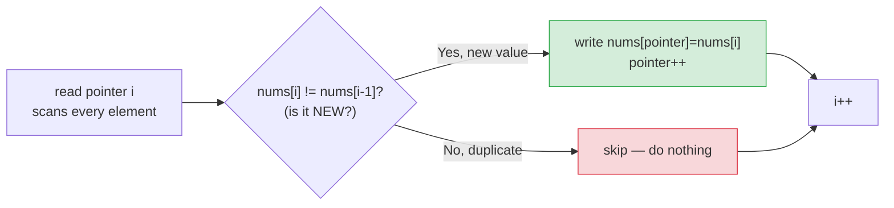

# 🔢 Remove Duplicates from Sorted Array (LeetCode #26) — Complete Study Notes

> Notes for becoming a strong software engineer. Easy language, your own code explained, and an interview-ready *script* for talking through it.
> This is a classic **two-pointers, same-direction** problem — your solution is clean and optimal. ✅

---

## 📌 1. The Problem (in simple words)

You're given a **sorted** array. Remove the duplicates **in place** so each unique value appears only once, keeping the relative order. Return `k` — the count of unique elements. The first `k` slots of the array must hold those unique values; whatever comes after doesn't matter.

> "In place" = you can't create a new array; you must modify the given one using only **O(1) extra space.**

**Example:**
```
Input:  nums = [1, 1, 2, 2, 3]
Output: 3,  with nums = [1, 2, 3, _, _]   (first 3 slots are the unique values)
```

> Analogy 🎟️: imagine a queue of people holding tickets, already sorted by ticket number, with duplicates standing together. You walk down the line keeping a "write" spot. Every time you meet a **new** ticket number, you move it up to the next write spot. At the end, the front of the line is all the unique tickets, in order — and you never left the line (in place).

---

## ✅ 2. Your Solution (and why it's good)

```javascript
var removeDuplicates = function(nums) {
    let pointer = 1; // the WRITE pointer: next slot for a unique value

    for (let i = 1; i < nums.length; i++) { // i = the READ pointer, scans ahead
        if (nums[i] !== nums[i - 1]) {       // current differs from previous → it's NEW
            nums[pointer] = nums[i];         // write it at the write pointer
            pointer++;                       // advance the write pointer
        }
    }

    return pointer; // pointer = how many uniques we wrote = k
};
```

**This is the textbook optimal solution.** It's the **two-pointers, same-direction (read/write)** pattern from your two-pointers notes:
- `pointer` (often called `slow`) = the **write pointer** — the boundary of the "uniques so far" region.
- `i` (often called `fast`) = the **read pointer** — scans every element looking for the next new value.

> 💡 Why start both at `1`? Because index `0` is **always** unique (nothing before it to duplicate), so the first unique is already in place. You only need to start comparing from index `1`.

> ⚡ **Complexity:** **O(n) time** (one pass), **O(1) space** (in place — no extra array). This is the best possible; you must look at every element at least once.

---

## 🔍 3. How It Works — Step by Step

The clever part: because the array is **sorted**, all duplicates are **next to each other.** So a value is "new" exactly when it **differs from the one just before it** (`nums[i] !== nums[i-1]`).

Let's trace `nums = [1, 1, 2, 3, 3]`:

```
start: pointer=1
                  read(i)   nums[i] vs nums[i-1]   action                 array
i=1:   1 vs 1  →  same       skip                   [1,1,2,3,3]  pointer=1
i=2:   2 vs 1  →  different  write nums[1]=2, p=2    [1,2,2,3,3]  pointer=2
i=3:   3 vs 2  →  different  write nums[2]=3, p=3    [1,2,3,3,3]  pointer=3
i=4:   3 vs 3  →  same       skip                    [1,2,3,3,3]  pointer=3
end:   return pointer = 3   → first 3 slots [1,2,3] are the uniques ✅
```



> 💡 The two pointers move at **different speeds**: `i` advances **every** step (it reads everything), but `pointer` advances **only when a new value is found**. That gap between them is exactly the number of duplicates skipped so far.

---

## 🎤 4. The Interview Script — How to Talk Through It Out Loud

Here's how to actually *narrate* this in an interview, step by step. Interviewers grade your **communication and approach**, not just the final code. Speak in this order:

**① Restate the problem (confirm you understood):**
> "So I'm given a sorted array, and I need to remove duplicates in place so each unique element appears once, then return the count of uniques. The array's already sorted, which is the key detail."

**② Spot the key insight out loud:**
> "Since it's sorted, all duplicates are adjacent. So I can detect a duplicate just by comparing each element to the one before it — I don't need a hash set to track what I've seen."

**③ Propose the approach before coding:**
> "I'll use two pointers moving the same direction — a write pointer for where the next unique value goes, and a read pointer that scans the whole array. When the read pointer finds a value different from the previous one, I copy it to the write position and advance the write pointer."

**④ State the complexity upfront:**
> "This is one pass, so O(n) time, and it's in place with O(1) extra space — which is optimal since we have to read every element at least once."

**⑤ Then code it, narrating as you go:**
> "I start both at index 1, because index 0 is always unique. For each element, if it differs from the previous one, I write it at the pointer and increment. At the end, the pointer is the count of uniques."

**⑥ Verify with a quick trace (do this proactively!):**
> "Let me trace `[1,1,2]`: i=1, 1 equals 1, skip. i=2, 2 differs from 1, write nums[1]=2, pointer becomes 2. Return 2, array is [1,2,...]. Correct."

> 🎯 **Why narrate like this:** it shows structured thinking — understand → insight → approach → complexity → code → verify. That sequence is what senior interviewers want to see. Coding silently and only talking at the end is a missed opportunity.

---

## 🟢 5. Likely Follow-up Questions (and answers)

> **Q: "Why does comparing to the previous element work?"**
> A: "Because the array is sorted, duplicates are guaranteed to be adjacent. If a value equals the one right before it, it's a duplicate; if it differs, it's a new unique. Sortedness is what makes this O(1) check valid — on an unsorted array I'd need a hash set."

> **Q: "What if the array were NOT sorted?"**
> A: "Then duplicates wouldn't be adjacent, so the previous-element trick fails. I'd use a hash Set to track seen values — O(n) time but O(n) space. The sorted version is better because it needs no extra space."

> **Q: "What about an empty array or a single element?"**
> A: "Empty: the loop starts at i=1 and never runs, and... I'd want pointer to be 0 for an empty array. With `pointer=1` and an empty array, the loop doesn't run and it returns 1, which is a bug — so I'd add a guard: `if (nums.length === 0) return 0;`. For a single element it correctly returns 1." *(See the note below — this is a real edge case worth mentioning!)*

> **Q: "Can you allow each element at most twice instead of once?"** (LeetCode #80, the follow-up)
> A: "Yes — instead of comparing to `nums[i-1]`, I compare to `nums[pointer-2]`, the element two writes back. If the current value is greater than that, there are fewer than two copies already written, so I keep it. Same two-pointer structure."

---

## ⚠️ 6. One Edge Case to Tighten

Your solution starts `pointer = 1`. For a **non-empty** array this is perfect. But for an **empty** array (`nums = []`), the loop never runs and it returns `1` — which is wrong (an empty array has 0 uniques). LeetCode's constraints usually guarantee `nums.length >= 1`, so it passes there, but mentioning this in an interview is a **green flag**:

```javascript
var removeDuplicates = function(nums) {
    if (nums.length === 0) return 0; // ← guard for the empty case
    let pointer = 1;
    for (let i = 1; i < nums.length; i++) {
        if (nums[i] !== nums[i - 1]) {
            nums[pointer] = nums[i];
            pointer++;
        }
    }
    return pointer;
};
```

> 💡 Proactively saying *"this assumes at least one element; I'd guard the empty case"* shows you think about edge cases without being prompted — exactly what separates a senior candidate.

---

## 💎 7. Impressive Words & Phrases

| Instead of saying... | Say this 💪 |
|---|---|
| "Two index variables" | "**Two pointers, same direction**" |
| "The spot I write to" | "The **write pointer** (slow)" |
| "The one scanning ahead" | "The **read pointer** (fast)" |
| "Change the array directly" | "**In-place**, O(1) extra space" |
| "Duplicates are together" | "Duplicates are **adjacent** in a sorted array" |
| "The done part of the array" | "The **unique prefix / partition boundary**" |
| "Compare to the one before" | "Compare against the **previous element**" |
| "Best you can do" | "**Optimal** — O(n) is the lower bound here" |

**Power vocabulary:** *two-pointer (read/write), in-place, O(1) auxiliary space, partition boundary, adjacency in sorted data, monotonic pointer, lower bound, stable order.*

> 🌶️ Bonus flex — **"the gap between the pointers is the duplicate count":** *"A neat way to see the invariant: at any moment, `i - pointer` equals the number of duplicates skipped so far. The write pointer lags behind the read pointer by exactly the count of elements removed. Stating that invariant shows I understand *why* the algorithm is correct, not just that it works."*

---

## ⏱️ 8. Quick Revision (read 5 min before interview)

> **Problem:** sorted array → remove duplicates **in place**, return count `k`; first `k` slots hold the uniques.
>
> **Key insight:** array is **sorted → duplicates are adjacent**, so a value is new iff it **differs from the previous one** (no hash set needed).
>
> **Approach:** **two pointers, same direction.** `pointer` = write spot for next unique; `i` = read scanner. New value → write it, advance `pointer`. Return `pointer`.
>
> **Both start at 1** (index 0 is always unique).
>
> **Complexity:** **O(n) time, O(1) space** — optimal.
>
> **Edge case:** guard empty array (`if (nums.length===0) return 0`).
>
> **Unsorted version:** use a **hash Set** (O(n) time, O(n) space).
>
> **Follow-up (#80, allow twice):** compare to `nums[pointer-2]` instead.
>
> **Golden line:** *"Because the array is sorted, duplicates are adjacent — so I use a read pointer to scan and a write pointer for the unique region, copying a value only when it differs from the previous one. One pass, in place, O(n) time and O(1) space."*

---

### ✅ Practice checklist
- [ ] Re-solve from scratch without looking (you've got the pattern)
- [ ] Add the empty-array guard and explain why
- [ ] Trace `[1,1,2,3,3]` on paper, tracking both pointers
- [ ] Solve the unsorted version with a Set (contrast the space cost)
- [ ] Solve #80 (allow each element twice) — compare to `nums[pointer-2]`
- [ ] Do related: Move Zeroes (#283), Remove Element (#27) — same read/write pattern
- [ ] Practise the 6-step interview script **out loud**

Your solution is already optimal — now nail the *narration* and the edge case, and this becomes an easy interview win that shows off the two-pointer read/write pattern. 🚀
