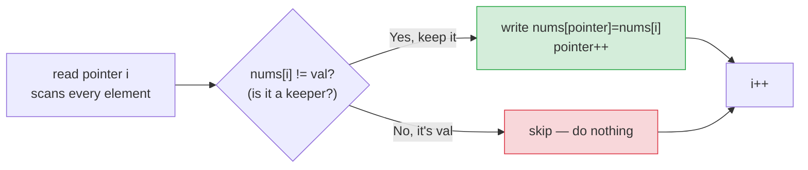

# 🗑️ Remove Element (LeetCode #27) — Complete Study Notes

> Notes for becoming a strong software engineer. Easy language, brute force → optimal, your own code explained, and an interview *script* for talking through it.
> A classic **two-pointers, same-direction (read/write)** problem. Your solution is clean and optimal. ✅

---

## 📌 1. The Problem (in simple words)

You're given an array `nums` and a value `val`. Remove **all** occurrences of `val` **in place** and return `k` — the count of remaining elements. The first `k` slots must hold the elements that are **not** `val`. The order can change, and whatever sits after the first `k` slots doesn't matter.

> "In place" = no new array; modify the given one using only **O(1) extra space.**

**Example:**
```
Input:  nums = [3, 2, 2, 3], val = 3
Output: 2,  with nums = [2, 2, _, _]   (first 2 slots are the non-3 elements)
```

> Analogy 🧺: imagine sorting laundry and throwing out every red sock. You keep a "keep pile" pointer. You go through each sock; if it's **not** red, you place it on top of the keep pile. At the end, the keep pile holds everything except red socks — and you never used a second basket (in place).

---

## 🐢 2. Brute Force First (what most interviewers want to hear first)

Interviewers usually want you to **state the naive approach first**, then improve it. There are two natural brute-force ideas:

### Brute force A — delete each `val` by shifting (O(n²))
The most literal "remove it" approach: whenever you see `val`, delete it and shift everything left.
```javascript
var removeElement = function(nums, val) {
    let i = 0;
    while (i < nums.length) {
        if (nums[i] === val) {
            nums.splice(i, 1); // remove → shifts ALL later elements left (O(n))
        } else {
            i++;
        }
    }
    return nums.length;
};
```
> ⚠️ Each `splice` shifts the rest of the array, so this is **O(n²) time**. It works, but it's slow — and that's exactly the thing you point out before improving it.

### Brute force B — build a new array (O(n) time, O(n) space)
A cleaner naive idea: copy all the non-`val` elements into a new array, then write them back.
```javascript
var removeElement = function(nums, val) {
    const kept = nums.filter(x => x !== val); // O(n) but a NEW array
    for (let i = 0; i < kept.length; i++) nums[i] = kept[i];
    return kept.length;
};
```
> ⚠️ This is **O(n) time but O(n) extra space** — it breaks the "in place, O(1) space" goal. Better than O(n²), but still not optimal.

> 🎯 The progression to say out loud: *"Naively I could splice each match — that's O(n²). Or build a new array — O(n) time but O(n) space. I can get O(n) time **and** O(1) space with two pointers."*

---

## ✅ 3. Your Optimal Solution (two pointers, in place)

```javascript
var removeElement = function(nums, val) {
    let pointer = 0; // WRITE pointer: next slot for a "keeper"
    for (let i = 0; i < nums.length; i++) { // i = READ pointer, scans everything
        if (nums[i] !== val) {              // current is NOT val → it's a keeper
            nums[pointer] = nums[i];        // write it at the write position
            pointer++;                       // advance the write pointer
        }
    }
    return pointer; // pointer = how many keepers we wrote = k
};
```

This is the **textbook optimal** answer — the **two-pointers, same-direction (read/write)** pattern:
- `pointer` (often called `slow`) = the **write pointer**, the boundary of the "kept" region.
- `i` (often called `fast`) = the **read pointer**, scanning every element.

> ⚡ **Complexity:** **O(n) time** (one pass), **O(1) space** (in place). Optimal — you must look at every element once.

> 💡 It naturally handles the tricky inputs: an **empty array** returns 0 (loop never runs), **all elements equal `val`** returns 0 (nothing written), and **no elements equal `val`** returns the full length. Starting `pointer = 0` is what makes the empty case correct.

---

## 🔍 4. How It Works — Step by Step

The idea: keep a **write pointer** for the next "keeper" slot. Scan with the **read pointer**; every time you find an element that is **not** `val`, copy it forward and advance the write pointer. Elements equal to `val` are simply **skipped** (overwritten later).

Trace `nums = [3, 2, 2, 3]`, `val = 3`:

```
start: pointer=0
                  read(i)   nums[i] vs val   action                 array
i=0:   3 vs 3  →  equal      skip            [3,2,2,3]   pointer=0
i=1:   2 vs 3  →  keeper      write nums[0]=2, p=1   [2,2,2,3]   pointer=1
i=2:   2 vs 3  →  keeper      write nums[1]=2, p=2   [2,2,2,3]   pointer=2
i=3:   3 vs 3  →  equal       skip            [2,2,2,3]   pointer=2
end:   return pointer = 2   → first 2 slots [2,2] are the keepers ✅
```



> 💡 The two pointers move at **different speeds**: `i` advances **every** step (reads everything), but `pointer` advances **only for keepers**. The gap `i - pointer` is exactly how many `val`s have been skipped so far.

---

## 🔄 5. Alternate Optimal — Swap From the End (fewer writes)

Because this problem **allows reordering**, there's a second optimal solution worth mentioning. When you hit a `val`, **overwrite it with the last element** and shrink the array. This does **fewer writes** when `val` is rare (it doesn't copy every keeper).
```javascript
var removeElement = function(nums, val) {
    let i = 0, n = nums.length;
    while (i < n) {
        if (nums[i] === val) {
            nums[i] = nums[n - 1]; // bring the last element here
            n--;                    // shrink — DON'T move i (recheck the swapped-in value)
        } else {
            i++;
        }
    }
    return n;
};
```
> 💡 When to prefer it: if you expect **very few** elements equal `val`, this minimises copying — most keepers never get touched. The trade-off is it **changes the order**, which is fine here (#27 allows it) but would be wrong for problems that must keep order (like #26).

> 🎯 Mentioning this shows range: *"Since the order can change, I could also swap matches with the last element and shrink — that does fewer writes when val is rare, at the cost of reordering."*

---

## 🎤 6. The Interview Script — How to Talk Through It

Narrate in this order. Interviewers grade your **approach and communication**, and most want the **brute force first**, then the optimisation.

**① Restate the problem:**
> "I need to remove every occurrence of `val` from the array in place and return the count of remaining elements. The first part of the array should hold the keepers; order doesn't matter."

**② Give the brute force first (interviewers expect this):**
> "The naive approach is to delete each `val` and shift the rest left — but each delete is O(n), so that's O(n²). A slightly better naive way is to build a new array of the non-val elements — O(n) time but O(n) extra space."

**③ Then propose the optimal:**
> "I can do O(n) time and O(1) space with two pointers moving the same direction — a write pointer for the next keeper slot, and a read pointer that scans everything. When the read pointer finds a non-val element, I copy it to the write position and advance."

**④ State the complexity:**
> "That's one pass — O(n) time, O(1) space — which is optimal since we must inspect every element."

**⑤ Code it, narrating:**
> "Write pointer starts at 0. For each element, if it's not val, I write it at the pointer and increment. At the end the pointer is the count of keepers."

**⑥ Verify with a trace (proactively):**
> "Trace [3,2,2,3], val=3: i=0 is 3, skip. i=1 is 2, write nums[0]=2, pointer 1. i=2 is 2, write nums[1]=2, pointer 2. i=3 is 3, skip. Return 2, array starts [2,2]. Correct."

**⑦ (Bonus) offer the alternate:**
> "Since order can change, I could also swap matches with the last element and shrink the length — fewer writes when val is rare."

> 🎯 **Why this flow wins:** brute force → complexity → optimal → code → verify → alternative. Showing the naive approach first proves you can analyse trade-offs, and offering an alternative shows depth. That sequence is what senior interviewers reward.

---

## 🟢 7. Likely Follow-up Questions (and answers)

> **Q: "Why is the two-pointer version better than splicing?"**
> A: "Splicing shifts the rest of the array on every removal, making it O(n²). The two-pointer version writes each keeper at most once in a single pass — O(n) time, O(1) space."

> **Q: "Does the order of the kept elements matter here?"**
> A: "No — #27 says the order can change. That's why the swap-from-end variant is valid. If order had to be preserved, I'd use the read/write version, which keeps relative order."

> **Q: "What's the difference between this and Remove Duplicates (#26)?"**
> A: "Same read/write two-pointer skeleton. #26 skips an element when it equals the *previous* one (relies on sortedness); #27 skips when it equals a *given value* `val`. The condition changes, the structure is identical."

> **Q: "How many writes does each approach do?"**
> A: "The read/write version writes once per keeper. The swap-from-end version writes once per *removed* element — so it's cheaper when removals are rare, pricier when they're common."

---

## 💎 8. Impressive Words & Phrases

| Instead of saying... | Say this 💪 |
|---|---|
| "Two index variables" | "**Two pointers, same direction**" |
| "The spot I write to" | "The **write pointer** (slow)" |
| "The one scanning ahead" | "The **read pointer** (fast)" |
| "Change the array directly" | "**In-place**, O(1) extra space" |
| "Delete and shift" | "**Splice shifts elements → O(n²)**" |
| "The kept elements" | "The **keepers / partition boundary**" |
| "Swap with the last one" | "**Overwrite with the tail element** and shrink" |
| "Best you can do" | "**Optimal** — O(n) is the lower bound" |

**Power vocabulary:** *two-pointer (read/write), in-place, O(1) auxiliary space, partition boundary, brute force vs optimal, splice/shift O(n²), swap-from-end, write minimisation, stable vs unstable order, lower bound.*

> 🌶️ Bonus flex — **"choose the variant by how often you remove":** *"There are two optimal in-place solutions: the read/write copy does one write per *keeper*, while the swap-from-end does one write per *removed* element. So if I expect to remove very few elements, swap-from-end is cheaper; if I expect to remove most, read/write is cheaper. Picking based on the expected removal rate shows I'm optimising for the actual workload, not just Big-O."*

---

## ⏱️ 9. Quick Revision (read 5 min before interview)

> **Problem:** remove all `val` **in place**, return count `k`; first `k` slots are the keepers. **Order can change.**
>
> **Brute force:** splice each match → **O(n²)** (shifting); or new array → **O(n) time, O(n) space**.
>
> **Optimal (read/write two pointers):** `pointer` = write slot for keepers; `i` = read scanner. If `nums[i] !== val` → write & advance. Return `pointer`. **O(n) time, O(1) space.**
>
> **Both start at 0** → empty array correctly returns 0.
>
> **Alternate optimal (swap-from-end):** on a match, `nums[i] = nums[n-1]; n--` (don't advance i). Fewer writes when `val` is rare; **reorders** (fine for #27).
>
> **vs #26:** same skeleton; #26 compares to previous element (sorted), #27 compares to `val`.
>
> **Golden line:** *"I scan with a read pointer and keep a write pointer for non-val elements — copy a keeper, advance the write pointer. One pass, in place, O(n) time, O(1) space. Since order can change, I can also swap matches with the tail to minimise writes when val is rare."*

---

### ✅ Practice checklist
- [ ] Re-solve from scratch without looking
- [ ] Write the brute-force splice version and explain why it's O(n²)
- [ ] Write the swap-from-end variant and explain when it's better
- [ ] Trace [3,2,2,3], val=3 on paper, tracking both pointers
- [ ] Practise the 7-step interview script **out loud** (brute → optimal → alternate)
- [ ] Do related: Remove Duplicates #26, Move Zeroes #283 — same read/write pattern

Your solution is already optimal — now nail the brute-force-first narration and the swap-from-end alternative, and this is an easy interview win that shows off the read/write two-pointer pattern. 🚀
