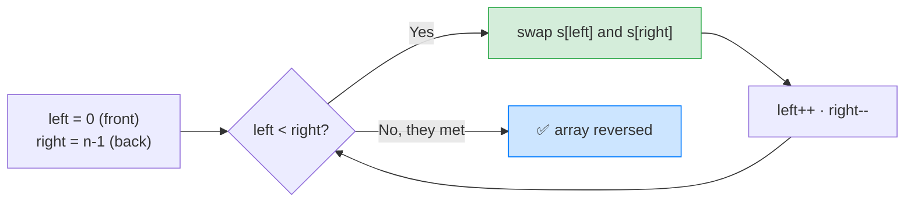

# 🔁 Reverse String (LeetCode #344) — Complete Study Notes

> Notes for becoming a strong software engineer. Easy language, brute force → optimal, your own code explained, and an interview *script*.
> A classic **two-pointers, opposite-ends** problem. Your solution is clean and optimal. ✅

---

## 📌 1. The Problem (in simple words)

You're given a string as a **character array** `s`. Reverse it **in place** — no new array, only **O(1) extra space**. Don't return anything; just modify `s` directly.

**Example:**
```
Input:  s = ['h','e','l','l','o']
After:  s = ['o','l','l','e','h']
```

> Analogy 🔄: imagine people standing in a line and you want to flip the order. The fastest way: the **first** and **last** person swap places, then the **second** and **second-last** swap, and so on, walking inward. When the two meet in the middle, the whole line is reversed — and nobody ever left the line (in place).

---

## 🐢 2. Brute Force First (what interviewers want to hear first)

The naive idea: read the array **backwards** into a new array, then copy it back.
```javascript
var reverseString = function(s) {
    const result = [];
    for (let i = s.length - 1; i >= 0; i--) {
        result.push(s[i]);   // read from the back → build reversed
    }
    for (let i = 0; i < s.length; i++) {
        s[i] = result[i];    // copy back (must modify in place)
    }
};
```
> ⚠️ This is **O(n) time but O(n) extra space** — it uses a second array, which breaks the "in place, O(1) space" requirement. It works, but it's the thing you improve on.

> 🎯 Say out loud: *"Naively I'd build a reversed copy and write it back — O(n) time but O(n) space. I can do it in place with O(1) space using two pointers."*

---

## ✅ 3. Your Optimal Solution (two pointers, in place)

```javascript
var reverseString = function(s) {
    let left = 0;
    let right = s.length - 1;

    while (left < right) {        // walk the two pointers toward each other
        const temp = s[left];     // classic 3-step swap
        s[left] = s[right];
        s[right] = temp;

        left++;
        right--;
    }
};
```

This is the **textbook optimal** answer — the **two-pointers, opposite-ends (converging)** pattern: one pointer starts at the front, one at the back, they **swap** and move **toward each other** until they meet.

> ⚡ **Complexity:** **O(n) time** (each element touched once), **O(1) space** (in place, just a `temp` variable).

> 💡 Tiny refinement vs your version: you wrote `left <= right`, which also works perfectly — the only difference is that on an **odd-length** array it does one extra swap of the middle element **with itself** (a harmless no-op). Using `left < right` skips that one wasted swap. Both are correct; `<` is just the conventional choice.

> 💡 The problem says "modify in place, return nothing" — so the `return s` is optional (LeetCode ignores it). Harmless, but technically not needed.

---

## 🔍 4. How It Works — Step by Step

Swap the ends, then move inward. Trace `s = ['h','e','l','l','o']`:

```
start: left=0, right=4
                          swap                array
left=0, right=4:  swap h,o   → ['o','e','l','l','h']   left=1, right=3
left=1, right=3:  swap e,l   → ['o','l','l','e','h']   left=2, right=2
left=2, right=2:  left < right is false → STOP (middle 'l' stays put)
result: ['o','l','l','e','h']  ✅
```



> 💡 The two pointers move **toward each other** (unlike the read/write pattern in #26/#27 where both move the same way). Each swap fixes **two** positions at once, so you only need about **n/2** swaps to reverse the whole array.

---

## 🔧 5. Alternate — JavaScript Built-In (`.reverse()`)

Since `s` is an **array**, JavaScript's built-in `Array.prototype.reverse()` reverses it **in place** in one line:
```javascript
var reverseString = function(s) {
    s.reverse();   // built-in, reverses the array in place
};
```
> 💡 Good to *know*, but interviewers asking this question almost always want the **manual two-pointer** version — the whole point is to see you understand the swapping mechanics, not call a library function. Mention the built-in to show awareness, then write the two-pointer solution. *"I know `s.reverse()` does it in one line, but I'll show the two-pointer approach since that's what this question is really testing."*

---

## 🎤 6. The Interview Script — How to Talk Through It

Narrate in this order — brute force first, then the optimal:

**① Restate:**
> "I need to reverse a character array in place, with O(1) extra space, modifying it directly."

**② Brute force first:**
> "The naive way is to read it backwards into a new array and copy it back — O(n) time but O(n) space, which breaks the in-place requirement."

**③ Propose the optimal:**
> "I'll use two pointers from both ends — front and back — swapping the characters and moving inward until they meet. That reverses it in place."

**④ Complexity:**
> "O(n) time since each element is touched once, and O(1) space — just a temp variable for the swap."

**⑤ Code it, narrating:**
> "Left starts at 0, right at the last index. While left is less than right, I swap them with a temp variable, then move left up and right down."

**⑥ Verify with a trace:**
> "Trace ['h','e','l','l','o']: swap h and o, swap e and l, pointers meet at the middle 'l'. Result is ['o','l','l','e','h']. Correct."

**⑦ (Bonus) mention the built-in:**
> "There's also `s.reverse()` built in, but I assume you want the manual approach to see the technique."

> 🎯 **Why this flow wins:** brute force → complexity → optimal → code → verify → built-in awareness. It shows you analyse trade-offs and know the language, while still demonstrating the core technique.

---

## 🟢 7. Likely Follow-up Questions (and answers)

> **Q: "Why two pointers instead of a new array?"**
> A: "Two pointers reverses in place with O(1) space. Building a reversed copy is O(n) space, which the problem forbids."

> **Q: "How many swaps does it do?"**
> A: "About n/2 — each swap places two characters correctly, so I only iterate to the middle."

> **Q: "What if it were a real string, not a char array?"**
> A: "Strings are immutable in JavaScript, so I can't swap characters in place. I'd convert with `s.split('')`, reverse, then `join('')` — but that's O(n) space. The in-place swap only works because we're given a mutable array."

---

## 💎 8. Impressive Words & Phrases

| Instead of saying... | Say this 💪 |
|---|---|
| "Two index variables" | "**Two pointers, opposite ends**" |
| "Move toward the middle" | "**Converging pointers**" |
| "Change the array directly" | "**In-place**, O(1) extra space" |
| "Swap with a temp" | "A **three-step swap**" |
| "Goes through half" | "About **n/2** swaps" |
| "When they cross" | "Until the pointers **meet/cross**" |
| "Strings can't change" | "Strings are **immutable**" |

**Power vocabulary:** *two-pointer (converging), opposite-end pointers, in-place, O(1) auxiliary space, three-step swap, immutable strings, n/2 iterations, symmetric swap.*

> 🌶️ Bonus flex — **"each swap is symmetric, so it's n/2":** *"The reason it's only n/2 iterations is that every swap fixes a symmetric pair — position i and position n−1−i — in one move. So I only walk to the midpoint, not the full length. Reversal is the simplest converging-pointer problem and the same idea underlies palindrome checks."* Linking it to palindromes shows you see the pattern across problems.

---

## ⏱️ 9. Quick Revision (read 5 min before interview)

> **Problem:** reverse a **char array in place**, O(1) space, return nothing.
>
> **Brute force:** read backwards into a new array, copy back → **O(n) time, O(n) space** (breaks in-place).
>
> **Optimal (two pointers, opposite ends):** `left=0`, `right=n-1`; while `left < right` → swap, `left++`, `right--`. **O(n) time, O(1) space.** ~n/2 swaps.
>
> **`left < right` vs `<=`:** both correct; `<` skips a harmless middle self-swap on odd lengths.
>
> **Built-in:** `s.reverse()` (one line) — but interviews want the manual two-pointer.
>
> **Real string?** Immutable → `s.split('').reverse().join('')` (O(n) space); in-place swap needs a mutable array.
>
> **Golden line:** *"I put one pointer at each end, swap the characters, and move them toward each other until they meet — reversing in place with O(1) space and about n/2 swaps."*

---

### ✅ Practice checklist
- [ ] Re-solve from scratch (you've got the pattern)
- [ ] Write the brute-force new-array version and explain why it's O(n) space
- [ ] Trace ['h','e','l','l','o'] on paper, tracking both pointers
- [ ] Note `s.reverse()` exists, but practise the two-pointer version
- [ ] Practise the interview script **out loud** (brute → optimal → built-in)
- [ ] Do related: Valid Palindrome #125 (same converging pointers), Reverse Vowels #345

Your solution is already optimal — now nail the brute-force-first narration and the built-in awareness, and this is an easy interview win showing the converging two-pointer pattern. 🚀
