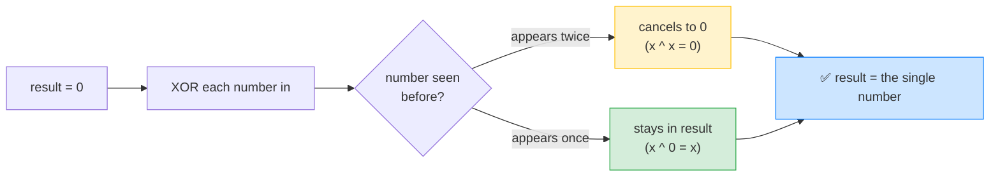

# 🎯 Single Number (LeetCode #136) — Complete Study Notes

> Notes for becoming a strong software engineer. Easy language, the problem explained simply, brute force → your solution → optimal, and an interview *script*.
> Your solution is **correct** — and we'll add the famous **XOR** trick that does it in O(1) space. ✅

---

## 🤔 1. What Is This Question Asking? (quick)

You're given an array where **every number appears exactly twice — except one number, which appears only once.** Find that single number.

**Example:**
```
Input:  nums = [4, 1, 2, 1, 2]
Output: 4
        (1 appears twice, 2 appears twice, but 4 appears once → answer is 4)
```

> 🧩 Plain words: *"Everything comes in pairs except one lonely number. Find the lonely one."*

> 💡 You're guaranteed **exactly one** number appears once; all others appear exactly twice.

---

## 🐢 2. Brute Force First

**Naive idea:** for each number, count how many times it appears in the whole array; the one with count 1 is the answer.
```javascript
var singleNumber = function(nums) {
    for (let i = 0; i < nums.length; i++) {
        let count = 0;
        for (let j = 0; j < nums.length; j++) {
            if (nums[j] === nums[i]) count++;
        }
        if (count === 1) return nums[i];
    }
};
```
> ⚠️ Two nested loops → **O(n²)** time. Correct, but slow. That's what you improve on.

> 🎯 Say out loud: *"The naive way is to count each number's occurrences — O(n²). I can use a hash map for O(n) time, and even better, XOR for O(1) space."*

---

## ✅ 3. Your Solution (hash counting — O(n) time)

```javascript
var singleNumber = function(nums) {
    let hash = {};

    // Pass 1: count how many times each number appears.
    for (let i = 0; i < nums.length; i++) {
        if (hash[nums[i]]) hash[nums[i]]++;
        else hash[nums[i]] = 1;
    }

    // Pass 2: return the number whose count is 1.
    for (let j = 0; j < nums.length; j++) {
        if (hash[nums[j]] == 1) return nums[j];
    }
};
```

**This is correct and a solid approach** — the **frequency-counting hash map** pattern (from your Hash Maps notes). You tally every number, then return the one that appeared once.

> ⚡ **Complexity:** **O(n) time** (two passes), **O(n) space** (the hash stores up to n entries).

> ⚠️ The one thing to improve: it uses **O(n) extra space** for the hash. This specific problem can be solved with **O(1) space** using XOR — and that's almost always the interviewer's follow-up here: *"can you do it without extra memory?"*

---

## ⭐ 4. The Optimal — XOR (O(1) space, the expected answer)

```javascript
var singleNumber = function(nums) {
    let result = 0;
    for (let i = 0; i < nums.length; i++) {
        result ^= nums[i];   // XOR every number together
    }
    return result;           // pairs cancel out → only the single number remains
};
```

> ⚡ **Complexity:** **O(n) time** (one pass), **O(1) space** (just one variable). This is the answer this problem is famous for.

### What is XOR (`^`)?
XOR is a **bitwise** operation that gives `1` when two bits **differ**, and `0` when they're the **same**:
```
0 ^ 0 = 0      1 ^ 0 = 1
0 ^ 1 = 1      1 ^ 1 = 0
```
It has **three magic properties** that make this problem trivial:

| Property | Meaning |
|---|---|
| `x ^ x = 0` | A number XORed with **itself** is **0** (pairs cancel!) |
| `x ^ 0 = x` | A number XORed with **0** is **itself** (0 is the identity) |
| order doesn't matter | XOR is **commutative & associative** — you can rearrange freely |

> 💡 **Why it solves the problem:** XOR every number together. Because every number that appears **twice** cancels itself to 0 (`x ^ x = 0`), and the single number XORed with all those 0s stays itself (`x ^ 0 = x`) — the final result is **exactly the single number.**

---

## 🔍 5. How XOR Works — Step by Step

Trace `nums = [4, 1, 2, 1, 2]`:
```
Rearrange (order doesn't matter):
  4 ^ 1 ^ 2 ^ 1 ^ 2
= 4 ^ (1 ^ 1) ^ (2 ^ 2)     ← group the pairs
= 4 ^    0    ^    0         ← each pair cancels to 0
= 4                          ← XOR with 0 leaves 4   ✅
```

Step by step in the loop:
```
result = 0
^4  → result = 4
^1  → result = 5
^2  → result = 7
^1  → result = 6   (the second 1 starts cancelling the first)
^2  → result = 4   (the second 2 cancels → only 4 left)
return 4  ✅
```



> 💡 The beauty: you don't need to *track* which numbers you've seen — the math does it automatically. Duplicates erase themselves, and the lonely number survives.

---

## 🔧 6. Built-In Function?

Your counting can be written with built-ins (a `Map` or `.reduce()`), but they're the **same O(n)-space approach**. There's no built-in shortcut that beats XOR's O(1) space — so XOR is the answer to write. (One built-in-flavoured trick: add numbers to a `Set` and **delete on the second sighting**, leaving only the single number — but that's still O(n) space.)

---

## 🎤 7. The Interview Script — How to Talk Through It

Narrate in this order — brute force → hash → the XOR optimal:

**① Restate:**
> "Every number appears twice except one, and I need to find the one that appears once."

**② Brute force first:**
> "The naive way is to count each number's occurrences — O(n²). A hash map brings that to O(n) time, but it uses O(n) space."

**③ Propose the optimal (the insight):**
> "I can do O(n) time and O(1) space using XOR. XOR has two key properties: a number XORed with itself is 0, and XORed with 0 is itself. So if I XOR every number together, the pairs cancel out and the single number is left."

**④ Complexity:**
> "One pass, O(n) time, O(1) space — just one accumulator variable, no hash."

**⑤ Code it, narrating; then verify:**
> "I XOR all the numbers into a result starting at 0. Trace [4,1,2,1,2]: the two 1s cancel, the two 2s cancel, and 4 remains. So the answer is 4."

**⑥ Explain why it's safe (shows depth):**
> "It works because XOR is commutative, so the order doesn't matter — every duplicate pair cancels regardless of where they sit in the array."

> 🎯 **Why this flow wins:** brute force → hash → XOR insight → complexity → verify. Showing you *know* the hash approach but *choose* XOR for O(1) space demonstrates you optimise deliberately, not by luck.

---

## 🟢 8. Likely Follow-up Questions (and answers)

> **Q: "Can you do it without extra memory?"** (the #1 follow-up)
> A: "Yes — XOR all the numbers. Duplicates cancel (x ^ x = 0) and the single number survives (x ^ 0 = x). O(n) time, O(1) space, no hash."

> **Q: "Why does XOR cancel the pairs?"**
> A: "Because x XOR x is 0 for any number, and XOR is commutative and associative — so I can mentally group each duplicate pair together, each becomes 0, and 0 XOR the single number is the single number."

> **Q: "What if every element appears three times except one?"** (#137, the escalation)
> A: "Plain XOR won't work since triples don't cancel to 0. I'd count the bits at each position modulo 3, or use bitmask logic — a different technique. But for the appears-twice version, XOR is perfect."

> **Q: "Is the hash approach wrong?"**
> A: "No, it's correct and O(n) time — just O(n) space. XOR is preferred here only because it achieves O(1) space."

---

## 💎 9. Impressive Words & Phrases

| Instead of saying... | Say this 💪 |
|---|---|
| "XOR everything" | "**Bitwise XOR** accumulation" |
| "Pairs cancel" | "**Self-cancelling** pairs (`x ^ x = 0`)" |
| "XOR with 0 keeps it" | "**0 is the identity** for XOR" |
| "Order doesn't matter" | "XOR is **commutative and associative**" |
| "Count each number" | "A **frequency map**" |
| "No extra memory" | "**O(1) auxiliary space**" |
| "Lonely number" | "The **unique / unpaired element**" |

**Power vocabulary:** *bitwise XOR, self-cancelling pairs, identity element, commutative, associative, O(1) auxiliary space, frequency map, accumulator, involution, unpaired element.*

> 🌶️ Bonus flex — **"XOR is its own inverse":** *"The elegant property here is that XOR is its own inverse — applying the same value twice returns to the original, so duplicates self-erase. That lets me find the unique element with no memory of what I've seen. It's the same self-cancelling idea behind detecting a missing number with XOR too."* Linking it to the missing-number XOR trick shows you see the pattern across problems.

---

## ⏱️ 10. Quick Revision (read 5 min before interview)

> **Problem:** every number appears **twice except one** (appears once) → find the single one.
>
> **Brute force:** count each number's occurrences → **O(n²)**.
>
> **Hash (your version):** frequency map, return count-1 → **O(n) time, O(n) space.**
>
> **⭐ Optimal (XOR):** `result = 0`; XOR every number in → pairs cancel, single survives. **O(n) time, O(1) space.**
>
> **XOR magic:** `x ^ x = 0` (pairs cancel), `x ^ 0 = x` (identity), order doesn't matter.
>
> **Built-in:** no shortcut beats XOR's O(1) space.
>
> **Escalation (#137, appears 3×):** XOR alone fails → bit-count mod 3.
>
> **Golden line:** *"I XOR every number together. Since a number XORed with itself is zero and with zero is itself, all the pairs cancel and the single number remains — O(n) time and O(1) space, no extra memory."*

---

### ✅ Practice checklist
- [ ] Re-solve your hash version, then learn the XOR version
- [ ] Write the O(n²) brute force and explain why it's slow
- [ ] Memorise the 3 XOR properties (`x^x=0`, `x^0=x`, commutative)
- [ ] Trace [4,1,2,1,2] with XOR (watch the pairs cancel)
- [ ] Explain *why* XOR needs no extra memory — out loud
- [ ] (Stretch) look at #137 "Single Number II" (appears three times)
- [ ] Practise the interview script (brute → hash → XOR)

Your solution is correct — now learn the XOR trick, since "do it with O(1) space" is the follow-up you'll almost always get on this problem. 🚀
