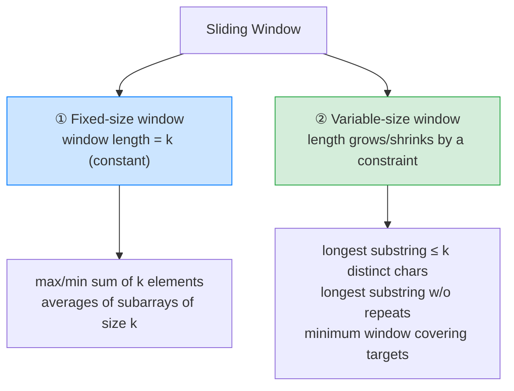

# 🪟 Sliding Window — Complete Study Notes

> Notes for becoming a strong software engineer. Easy language, real code, and interview-ready explanations.
> The go-to pattern for substring and contiguous-subarray problems — turns O(n²) scans into one clean O(n) pass.

---

## 📌 1. What is the Sliding Window Technique?

A sliding window maintains a **contiguous chunk** (a "window") of an array or string, defined by a **left** and **right** boundary. You **expand** the window by moving `right` forward, and **shrink** it by moving `left` forward — sliding the window across the data while tracking some state (a sum, a character count, etc.). Instead of recomputing from scratch for every possible subarray, you **reuse** the work as the window slides.

> Analogy 🚌: think of looking out of a **moving bus window** at a row of shops. The window shows a few shops at a time. As the bus moves, a new shop enters on the right and an old one leaves on the left — you never re-scan the whole street, you just track what's currently *in view*. Sliding window is exactly this: add what enters on the right, remove what leaves on the left, and keep a running picture of the window.

> 🎯 Interview line: *"Sliding window keeps a contiguous window with left and right boundaries — I expand right to grow it and move left to shrink it, maintaining running state instead of recomputing each subarray. That takes substring and subarray problems from O(n²) to O(n)."*

---

## ⚡ 2. Why It Works — Reuse Instead of Recompute

Brute force checks **every subarray**: pick a start, pick an end, compute → `O(n²)` (or worse with inner work). Sliding window keeps a **running state** and only does **O(1) work** as each boundary moves, so the whole thing is **one O(n) pass**.

```
Brute force (max sum of k):          Sliding window:
for start in 0..n:                   compute first window once,
  sum = 0                     →      then for each step: + new element,
  for j in start..start+k:             − element that left
    sum += arr[j]                    = O(n)  ⚡
= O(n·k)  🐢
```

> ⭐ It's a specialised **two pointers** (your two-pointers notes): both pointers move in the **same direction**, but here they bound a *window* and you track the window's *contents*. The magic is that `left` and `right` move at **different speeds**.

---

## 🎯 3. The Two Variants



| Variant | Window size | Classic problems |
|---|---|---|
| **① Fixed** | Constant `k` | Max sum of k consecutive, subarray averages |
| **② Variable** | Grows/shrinks to satisfy a constraint | Longest substring with ≤ k distinct, longest without repeats, **minimum window substring** |

---

## 💻 4. Variant ① — Fixed-Size Window

The window is always exactly `k` wide. Slide it: **add** the new right element, **subtract** the one that falls off the left.

### Example — Maximum sum of k consecutive elements
```javascript
function maxSumK(nums, k) {
  let windowSum = 0;
  // 1. Build the first window (first k elements).
  for (let i = 0; i < k; i++) windowSum += nums[i];
  let best = windowSum;

  // 2. Slide: add the entering element, remove the leaving one.
  for (let right = k; right < nums.length; right++) {
    windowSum += nums[right] - nums[right - k]; // +new  −old   (O(1) per step!)
    best = Math.max(best, windowSum);
  }
  return best;
}
// nums = [2,1,5,1,3,2], k = 3
// first window [2,1,5]=8 → slide [1,5,1]=7 → [5,1,3]=9 → [1,3,2]=6 → best = 9
// ⚡ O(n) — brute force recomputing each window is O(n·k)
```

> 💡 The key trick: `windowSum += nums[right] - nums[right - k]` updates the sum in **O(1)** by only accounting for the one element that entered and the one that left — never re-summing the whole window.

---

## 💻 5. Variant ② — Variable-Size Window (the important one)

The window **grows** until it breaks a constraint, then **shrinks** from the left until it's valid again. **The `while` loop inside the `for` loop is the heart of variable windows.**

### The universal template (memorise this) ⭐
```
left = 0
windowState = {}                    // a map/counter/sum describing the window
for right in 0..n-1:
    add arr[right] to windowState   // EXPAND: include the new right element
    while (windowState violates the constraint):
        remove arr[left] from windowState   // SHRINK from the left
        left++
    update answer                   // the window is now valid → record it
```

### Example A — Longest substring with AT MOST k distinct characters
```javascript
function longestKDistinct(s, k) {
  let left = 0, best = 0;
  const count = new Map(); // char -> how many times it's in the window

  for (let right = 0; right < s.length; right++) {
    // EXPAND: add the right char.
    count.set(s[right], (count.get(s[right]) || 0) + 1);

    // SHRINK while we have too many distinct chars.
    while (count.size > k) {
      const leftChar = s[left];
      count.set(leftChar, count.get(leftChar) - 1);
      if (count.get(leftChar) === 0) count.delete(leftChar);
      left++;
    }

    // The window now has ≤ k distinct chars → it's valid. Record its length.
    best = Math.max(best, right - left + 1);
  }
  return best;
}
// "eceba", k=2 → "ece" is the longest with ≤2 distinct → returns 3   ⚡ O(n)
```

### Example B — Longest substring WITHOUT repeating characters ⭐
The most-asked sliding-window problem.
```javascript
function longestUnique(s) {
  let left = 0, best = 0;
  const seen = new Set(); // chars currently in the window

  for (let right = 0; right < s.length; right++) {
    // SHRINK until the new char isn't a duplicate.
    while (seen.has(s[right])) {
      seen.delete(s[left]);
      left++;
    }
    seen.add(s[right]); // EXPAND
    best = Math.max(best, right - left + 1);
  }
  return best;
}
// "abcabcbb" → "abc" (length 3) is the longest unique window → returns 3   ⚡ O(n)
```

### Example C — Minimum Window Substring 🌶️ (the hard one)
Find the smallest window in `s` that contains all characters of `t`. Expand to become valid, then shrink to find the *smallest* valid window.
```javascript
function minWindow(s, t) {
  const need = new Map();
  for (const c of t) need.set(c, (need.get(c) || 0) + 1);

  let left = 0, have = 0, required = need.size;
  let bestLen = Infinity, bestStart = 0;
  const window = new Map();

  for (let right = 0; right < s.length; right++) {
    const c = s[right];
    window.set(c, (window.get(c) || 0) + 1);
    if (need.has(c) && window.get(c) === need.get(c)) have++;

    // While the window is VALID, try to shrink it from the left.
    while (have === required) {
      if (right - left + 1 < bestLen) { bestLen = right - left + 1; bestStart = left; }
      const lc = s[left];
      window.set(lc, window.get(lc) - 1);
      if (need.has(lc) && window.get(lc) < need.get(lc)) have--;
      left++;
    }
  }
  return bestLen === Infinity ? "" : s.substr(bestStart, bestLen);
}
// s="ADOBECODEBANC", t="ABC" → smallest window containing A,B,C is "BANC"   ⚡ O(n)
```

> 🎯 Interview line: *"For minimum window substring I expand the window until it contains all required characters, then shrink from the left while it stays valid to find the smallest one — tracking a 'have vs need' count so I know in O(1) whether the window is still valid."*

---

## 🧠 6. The Mental Model (expand vs shrink)

```
 [ . . . . . . . . . . . ]   the array
   ↑left            ↑right

 EXPAND →  move right, add element to window state
 SHRINK ←  move left,  remove element from window state

 Fixed window:    right moves, left follows k behind (window size constant)
 Variable window: right always moves; left moves only WHEN the constraint breaks
```

> 💡 The single distinction to remember: in a **fixed** window `left` moves every step (staying `k` behind); in a **variable** window `left` moves **only when needed** to restore validity. That conditional shrink (the `while`) is the whole trick.

---

## 🎤 7. How to Explain in an Interview

**Step 1 — The technique:**
> "Sliding window keeps a contiguous window with left/right boundaries and running state. I expand by moving right, shrink by moving left, and reuse the state instead of recomputing — so it's O(n)."

**Step 2 — When I reach for it:**
> "Contiguous subarray or substring problems with a constraint — 'longest/shortest/max-sum subarray such that...'. The contiguity is the signal."

**Step 3 — Fixed vs variable:**
> "Fixed-size when the window length is given — I slide adding the new element and removing the old one in O(1). Variable-size when the window grows or shrinks by a constraint — I expand right, then shrink left with a while loop until the window is valid again."

**Step 4 — The template:**
> "My variable-window template is: for each right, add to the window; while the constraint is violated, remove from the left and advance left; then update the answer. The inner while is the heart of it."

> 🟢 Trap question: *"How is sliding window O(n) if there's a while loop inside the for loop?"* → *"Because `left` only ever moves forward, never backward. Across the entire run, `left` advances at most n times total and `right` advances n times — so it's at most 2n pointer moves, which is O(n). The nested loop looks quadratic but the pointers are monotonic."*

> 🟢 Trap question: *"When is it NOT a sliding window?"* → *"When the subarray doesn't need to be contiguous, or when negative numbers break the 'shrinking always helps' assumption. For 'subarray sum equals k' with negatives, shrinking isn't monotonic, so I'd use a prefix-sum + hash map instead of a window."*

---

## 💎 8. Impressive Words & Phrases

| Instead of saying... | Say this 💪 |
|---|---|
| "A chunk of the array" | "A **contiguous window**" |
| "Make the window bigger/smaller" | "**Expand** and **contract** the window" |
| "Info about the window" | "The **window state** (counts/sum)" |
| "Update sum quickly" | "An **O(1) incremental update**" |
| "Window size stays the same" | "A **fixed-size window**" |
| "Window grows by a rule" | "A **variable-size window** with a constraint" |
| "Shrink when broken" | "**Contract on constraint violation**" |
| "Pointers move forward only" | "**Monotonic** pointers → amortised O(n)" |
| "Count needed vs have" | "A **need/have** satisfaction count" |

**Power vocabulary:** *contiguous window, expand/contract, window state, incremental O(1) update, fixed vs variable window, constraint violation, amortised O(n), monotonic pointers, two-pointer window, prefix sum (the alternative), need/have counter.*

> 🌶️ Bonus flex — **"it's amortised O(n), not O(n²)":** *"Even though there's a while loop nested in a for loop, the total time is amortised O(n): the left pointer can only move forward a total of n times across the whole algorithm, no matter how the inner loop runs. So the two pointers together make at most 2n moves. Recognising amortised analysis here is what proves it's linear."* This precise framing (amortised, not naive nested-loop counting) signals strong algorithmic depth.

---

## ⏱️ 9. Quick Revision (read 5 min before interview)

> **Sliding window = a contiguous window** with `left`/`right` boundaries + running **window state**. Expand right, shrink left. **O(n²) → O(n)** by reusing state.
>
> **Trigger:** **contiguous** subarray/substring + a constraint ("longest/shortest/max such that...").
>
> **① Fixed window (size k):** slide by `+nums[right] − nums[right−k]` → O(1) per step. (max sum of k.)
>
> **② Variable window (the template):**
> ```
> left = 0
> for right in 0..n-1:
>     add arr[right] to window
>     while (constraint violated):
>         remove arr[left]; left++
>     update answer
> ```
> The **inner while** (conditional shrink) is the heart. (longest ≤ k distinct, longest without repeats, **min window substring**.)
>
> **Why O(n):** `left` only moves forward → ≤ 2n total moves → **amortised O(n)** (not O(n²) despite the nested loop).
>
> **Not a window when:** non-contiguous, or negatives break monotonic shrinking → use **prefix sum + hash map**.
>
> **Golden line:** *"Sliding window maintains a contiguous window with running state — expand right, shrink left on constraint violation — and because left only moves forward, the nested loop is still amortised O(n)."*

---

### ✅ Practice checklist (LeetCode)
- [ ] Maximum Average Subarray I (#643) — fixed window
- [ ] Longest Substring Without Repeating Characters (#3) — the classic variable window
- [ ] Longest Substring with At Most K Distinct Characters (#340) — count-based shrink
- [ ] Minimum Size Subarray Sum (#209) — shrink-to-minimum
- [ ] Permutation in String (#567) — fixed window + char counts
- [ ] Minimum Window Substring (#76) — the hard one (need/have)
- [ ] Explain *amortised O(n)* (why the inner while doesn't make it O(n²)) — out loud

Sliding window is one of the highest-frequency interview patterns for strings and subarrays. Master the variable-window template and the amortised-O(n) reasoning, and a whole category of "hard" problems becomes routine. 🚀
