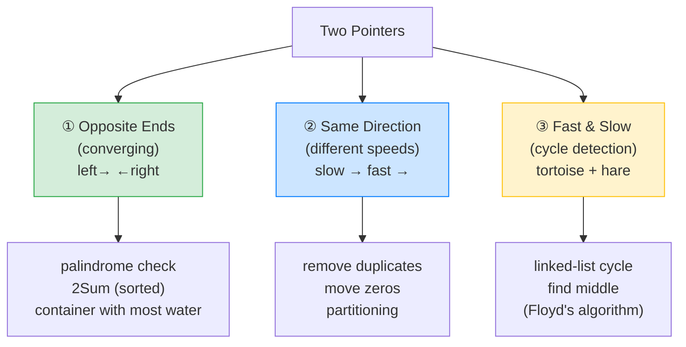

# 👉👈 Two Pointers — Complete Study Notes

> Notes for becoming a strong software engineer. Easy language, real code, and interview-ready explanations.
> One of the most useful DSA patterns — it turns many O(n²) brute-force solutions into clean O(n).

---

## 📌 1. What is the Two Pointers Technique?

Two pointers means using **two index variables** that walk through an array (the same one, or two different ones), either **moving toward each other** from the ends, or **moving in the same direction** at different speeds. By cleverly moving the pointers based on what you find, you avoid checking every pair — turning a slow nested loop into a single pass.

> Analogy 🤝: imagine two people searching a **sorted** shelf of books for two whose prices add up to ₹500. One starts at the cheapest end, one at the most expensive. If their two prices are **too high**, the expensive person steps down one book; if **too low**, the cheap person steps up. They walk toward each other and meet in the middle — finding the answer in **one sweep** instead of every person checking every book. That's two pointers.

> 🎯 Interview line: *"Two pointers uses two indices into an array, moving toward each other or in the same direction, so I can solve in one pass what brute force does with nested loops. It exploits sortedness or structure to drop from O(n²) to O(n)."*

---

## ⚡ 2. Why It Works — O(n²) → O(n)

Brute force checks **every pair**: for each element, scan all the others — that's `n × n = O(n²)`. Two pointers instead makes **one smart decision per step** about which pointer to move, so each element is visited **once** → **O(n)** time, usually **O(1)** extra space.

```
Brute force (find a pair):          Two pointers (sorted):
for i in 0..n:                      left=0, right=n-1
  for j in i+1..n:        →         while left < right:
    check (i, j)                      move ONE pointer based on the sum
= O(n²)  🐢                         = O(n)  ⚡
```

> ⭐ **Key insight to internalise:** *when the array is sorted, two pointers almost always beats nested binary-search loops.* If you see "sorted array" + "find a pair / triplet / compare", your first thought should be two pointers.

---

## 🎯 3. The Three Variants



| Variant | How pointers move | Classic problems |
|---|---|---|
| **① Opposite ends** | Start at both ends, move **toward** each other | Palindrome, 2Sum (sorted), Container With Most Water |
| **② Same direction** | Both start at front, move at **different speeds** | Remove Duplicates, Move Zeros, partitioning |
| **③ Fast & slow** | One moves 1 step, one moves 2 | Cycle detection, find middle of linked list |

---

## 💻 4. Variant ① — Opposite Ends (converging)

### Example A — Palindrome check
Two pointers from both ends, compare, move inward.
```javascript
function isPalindrome(s) {
  let left = 0, right = s.length - 1;
  while (left < right) {
    if (s[left] !== s[right]) return false; // mismatch → not a palindrome
    left++;
    right--;
  }
  return true;
}
// "racecar" → r==r, a==a, c==c, meet in middle → true  ✅  O(n) time, O(1) space
```

### Example B — 2Sum on a SORTED array ⭐
The textbook two-pointers problem. Find two numbers that add to a target.
```javascript
function twoSumSorted(nums, target) {
  let left = 0, right = nums.length - 1;
  while (left < right) {
    const sum = nums[left] + nums[right];
    if (sum === target) return [left, right];   // found it
    if (sum < target) left++;                     // too small → raise the low end
    else right--;                                 // too big   → lower the high end
  }
  return [-1, -1];
}
// nums = [2, 7, 11, 15], target = 9
// left=2, right=15 → 17 too big → right--
// left=2, right=11 → 13 too big → right--
// left=2, right=7  → 9  found! → [0, 1]   ⚡ O(n), no hash map needed
```

> 💡 Why it's correct: because the array is **sorted**, if the sum is too big the only way to shrink it is to move `right` left; if too small, move `left` right. Each move provably can't skip the answer. (For an *unsorted* 2Sum, a hash map is O(n) — two pointers needs the sort.)

### Example C — Container With Most Water 🌶️
Two lines form a container; maximise the water area. Move the **shorter** wall inward (it's the limiting one).
```javascript
function maxArea(height) {
  let left = 0, right = height.length - 1, best = 0;
  while (left < right) {
    const area = Math.min(height[left], height[right]) * (right - left);
    best = Math.max(best, area);
    // Move the SHORTER side — it limits the area, so it's our only hope to improve.
    if (height[left] < height[right]) left++;
    else right--;
  }
  return best;
}
// O(n) — brute force checking all pairs is O(n²)
```

> 🎯 Interview line: *"For Container With Most Water I move the pointer at the shorter wall inward, because the shorter wall caps the area — keeping the taller wall gives the only chance of a bigger container. That greedy choice keeps it O(n)."*

---

## 💻 5. Variant ② — Same Direction (fast & slow indices)

Here a **slow** pointer marks "where the next good element goes" and a **fast** pointer scans ahead. This is the **in-place modification** pattern.

### Example A — Remove Duplicates from a sorted array
```javascript
function removeDuplicates(nums) {
  if (nums.length === 0) return 0;
  let slow = 0; // last unique element's position
  for (let fast = 1; fast < nums.length; fast++) {
    if (nums[fast] !== nums[slow]) {
      slow++;
      nums[slow] = nums[fast]; // place the new unique value
    }
  }
  return slow + 1; // length of the unique part
}
// [1,1,2,3,3] → [1,2,3,...], returns 3   ⚡ O(n) time, O(1) space (in place)
```

### Example B — Move Zeros to the end
```javascript
function moveZeroes(nums) {
  let slow = 0; // next position for a non-zero
  for (let fast = 0; fast < nums.length; fast++) {
    if (nums[fast] !== 0) {
      [nums[slow], nums[fast]] = [nums[fast], nums[slow]]; // swap non-zero forward
      slow++;
    }
  }
}
// [0,1,0,3,12] → [1,3,12,0,0]   ⚡ O(n), in place, preserves order
```

> 💡 The mental model: `slow` is the **write pointer** (the boundary of the "done" region), `fast` is the **read pointer** scanning for the next thing to keep. This pattern handles a whole family of "filter/partition in place" problems.

---

## 💻 6. Variant ③ — Fast & Slow (cycle detection)

One pointer moves **1 step**, the other **2 steps**. If there's a loop, the fast one laps the slow one and they meet. (This is **Floyd's algorithm** — your detailed linked-list notes cover it; here's the shape.)
```javascript
function hasCycle(head) {
  let slow = head, fast = head;
  while (fast && fast.next) {
    slow = slow.next;        // 1 step
    fast = fast.next.next;   // 2 steps
    if (slow === fast) return true; // they met → cycle!
  }
  return false; // fast reached the end → no cycle
}
// O(n) time, O(1) space — no extra set needed to track visited nodes
```

> 💡 Also used to **find the middle** of a linked list: when `fast` reaches the end, `slow` is exactly halfway.

---

## 🎤 7. How to Explain in an Interview

**Step 1 — The technique:**
> "Two pointers uses two indices into an array — either converging from both ends, or moving the same way at different speeds — so I make one smart move per step instead of checking every pair."

**Step 2 — When I reach for it:**
> "Sorted array plus 'find a pair/triplet' or 'compare/partition' is the signal. Sortedness lets me decide which pointer to move without missing the answer."

**Step 3 — The complexity win:**
> "It turns O(n²) brute force into O(n) time, usually O(1) extra space, because each element is visited once."

**Step 4 — A concrete example:**
> "For 2Sum on a sorted array, I start at both ends: if the sum is too big I move the right pointer left, too small I move the left pointer right, until they meet. One pass, no hash map."

> 🟢 Trap question: *"Why does moving the shorter wall work in Container With Most Water?"* → *"The area is limited by the shorter wall times the width. Moving the taller wall inward can only shrink the width while the height stays capped by the short wall — so it can't improve. Moving the shorter wall is the only move that might find a taller limiting wall. That greedy reasoning keeps it O(n)."*

> 🟢 Trap question: *"Two pointers vs hash map for 2Sum?"* → *"If the array is sorted, two pointers is O(n) time and O(1) space — better than the hash map's O(n) space. If it's unsorted, sorting costs O(n log n), so the hash map's plain O(n) usually wins unless I need the sorted order anyway."*

---

## 💎 8. Impressive Words & Phrases

| Instead of saying... | Say this 💪 |
|---|---|
| "Two index variables" | "A **two-pointer** approach" |
| "Start from both ends" | "**Converging pointers** / inward scan" |
| "One slow, one fast" | "**Read and write pointers**" (same-direction) |
| "Change the array directly" | "**In-place**, O(1) extra space" |
| "Check every pair" | "Avoids the **O(n²) brute force**" |
| "Loop detection trick" | "**Floyd's cycle detection** (tortoise & hare)" |
| "Move the smaller one" | "A **greedy** pointer move" |
| "Because it's sorted" | "**Exploiting the sorted invariant**" |
| "Section that's done" | "The **partition boundary**" |

**Power vocabulary:** *two-pointer, converging/opposite-end pointers, read/write pointer, in-place, O(1) auxiliary space, sorted invariant, greedy move, partition boundary, Floyd's cycle detection (fast & slow), monotonic movement, linear scan.*

> 🌶️ Bonus flex — **"each pointer moves monotonically, so it's linear":** *"The reason two pointers is O(n) and not O(n²) is that across the whole run, each pointer only ever moves forward (or inward) — it never backtracks. So the total work is bounded by the array length, even though there are two pointers. That monotonic movement is the proof of linear time."* Explaining *why* it's O(n) (not just claiming it) signals real algorithmic understanding.

---

## ⏱️ 9. Quick Revision (read 5 min before interview)

> **Two pointers = two indices** moving toward each other (opposite ends) or same-direction at different speeds. Turns **O(n²) → O(n)**, usually **O(1) space**.
>
> **Trigger:** **sorted array** + "find a pair/triplet", "compare two arrays", or "modify in place". *Sorted array → think two pointers before nested loops.*
>
> **3 variants:**
> 1. **Opposite ends** (converge): palindrome, **2Sum sorted**, container with most water. → move a pointer based on too-big/too-small.
> 2. **Same direction** (slow=write, fast=read): remove duplicates, move zeros, partition in place.
> 3. **Fast & slow** (1 vs 2 steps): cycle detection, find middle (**Floyd's**).
>
> **2Sum sorted:** sum too big → `right--`; too small → `left++`; equal → found.
>
> **Container with water:** always move the **shorter** wall inward.
>
> **Why O(n):** each pointer moves **monotonically** (never backtracks) → total work ≤ n.
>
> **Golden line:** *"When an array is sorted, two pointers beats nested loops — converge from both ends moving the pointer that can improve the answer, and because each pointer only moves forward, it's a single O(n) pass."*

---

### ✅ Practice checklist (LeetCode)
- [ ] Valid Palindrome (#125) — opposite ends
- [ ] Two Sum II – Input Array Is Sorted (#167) — the canonical converging pattern
- [ ] Container With Most Water (#11) — greedy move the shorter wall
- [ ] 3Sum (#15) — sort, then two pointers inside a loop (the big one!)
- [ ] Remove Duplicates from Sorted Array (#26) — slow/fast write pointer
- [ ] Move Zeroes (#283) — same-direction swap
- [ ] Linked List Cycle (#141) — fast & slow (Floyd's)
- [ ] Explain *why* each pointer moving monotonically gives O(n) — out loud

Two pointers is a top-3 pattern for array/string interviews. Master the three variants and the "sorted → two pointers" reflex, and a huge class of problems becomes one clean linear pass. 🚀
