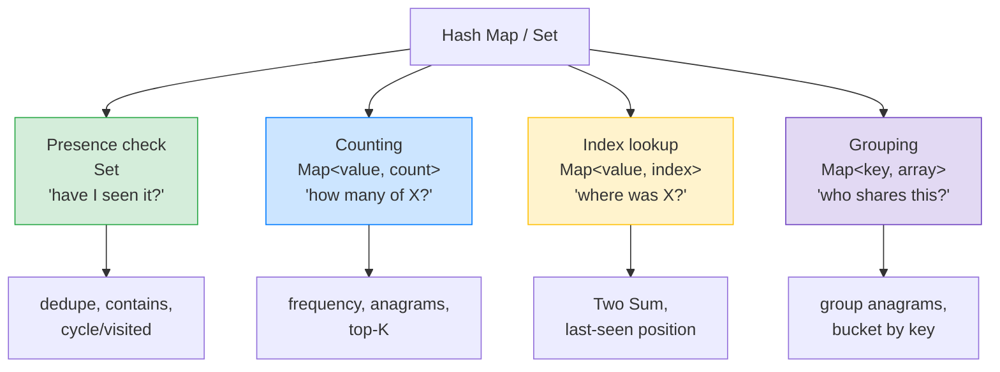

# 🗂️ Hash Maps — Complete Study Notes

> Notes for becoming a strong software engineer. Easy language, real code, and interview-ready explanations.
> The workhorse of DSA — O(1) lookups that turn a huge class of O(n²) problems into clean O(n).

---

## 📌 1. When to Use a Hash Map

Reach for a hash map (or hash set) whenever you need to answer, in **O(1)**:
- *"Have I seen this before?"* → a **Set** (presence check)
- *"How many times does X appear?"* → a **Map<key, count>** (counting)
- *"Where did I see X?"* → a **Map<value, index>** (index lookup)
- *"Which things share this property?"* → a **Map<key, array>** (grouping)

The core idea: a hash map **trades space for time.** You spend extra memory to remember things, so you can look them up instantly instead of re-scanning — turning **O(n²)** brute force into **O(n)**.

> Analogy 📇: a hash map is like a **phone's contacts**. Without it, finding someone's number means reading every name in order (a linear scan). With contacts, you type the name and **jump straight** to the number — O(1). You "paid" some memory to store the index, and you get instant lookups forever. That's the space-for-time trade.

> 🎯 Interview line: *"A hash map gives O(1) average lookup, insert, and delete. I use it whenever a problem needs 'have I seen this?', a count, an index, or grouping — it trades memory for speed and collapses many O(n²) brute-force solutions into O(n)."*

---

## ⚡ 2. Why It Works — Space for Time

```
Brute force (find a pair):           Hash map (one pass):
for i in 0..n:                       seen = {}
  for j in i+1..n:          →        for x in arr:
    if match(i, j) ...                 if (need(x) in seen) return ...
= O(n²)  🐢                            seen.add(x)
                                     = O(n) time, O(n) space  ⚡
```

> 💡 Under the hood, a hash map computes a **hash** of the key to find its slot directly — no scanning. Average operations are **O(1)**; the cost is **O(n) extra space** to store the entries. That space-for-time swap is the whole point.

---

## 🎯 3. The Four Core Patterns



| Pattern | Structure | Answers | Classic problems |
|---|---|---|---|
| **Presence** | `Set<value>` | "Seen it?" | Contains Duplicate, dedupe |
| **Counting** | `Map<value, number>` | "How many?" | Anagrams, frequency, top-K |
| **Index lookup** | `Map<value, index>` | "Where?" | Two Sum, last position |
| **Grouping** | `Map<key, array>` | "Who shares X?" | Group Anagrams |

---

## 💻 4. Pattern A — Presence Check (Set)

### Example — Contains Duplicate
```javascript
function containsDuplicate(nums) {
  const seen = new Set();
  for (const x of nums) {
    if (seen.has(x)) return true; // O(1) — already seen it
    seen.add(x);
  }
  return false;
}
// [1,2,3,1] → sees 1 again → true   ⚡ O(n) time, O(n) space
// (sorting first would be O(n log n); the set is faster.)
```

---

## 💻 5. Pattern B — Counting (Map<key, number>)

### Example A — Valid Anagram (do two strings have the same letters?)
```javascript
function isAnagram(s, t) {
  if (s.length !== t.length) return false;
  const count = new Map();
  for (const c of s) count.set(c, (count.get(c) || 0) + 1); // tally s
  for (const c of t) {
    if (!count.get(c)) return false;     // t has a char s doesn't (enough of)
    count.set(c, count.get(c) - 1);      // cancel it out
  }
  return true;
}
// "anagram" vs "nagaram" → all counts cancel → true   ⚡ O(n)
```

> 💡 The `(count.get(c) || 0) + 1` idiom is the universal "increment a counter in a map" pattern. In modern code you'd often use a plain object or `Map`; the logic is identical.

### Example B — First Unique Character
```javascript
function firstUniqChar(s) {
  const count = new Map();
  for (const c of s) count.set(c, (count.get(c) || 0) + 1); // count all
  for (let i = 0; i < s.length; i++) {
    if (count.get(s[i]) === 1) return i; // first char appearing exactly once
  }
  return -1;
}
// "leetcode" → 'l' is first unique → returns 0   ⚡ O(n)
```

---

## 💻 6. Pattern C — Index Lookup (Map<value, index>)

### Example — Two Sum (unsorted) ⭐
The single most famous hash-map problem. For each number, check if its **complement** was seen.
```javascript
function twoSum(nums, target) {
  const seen = new Map(); // value -> its index
  for (let i = 0; i < nums.length; i++) {
    const need = target - nums[i];
    if (seen.has(need)) return [seen.get(need), i]; // found the complement
    seen.set(nums[i], i);                           // remember this number
  }
  return [];
}
// nums = [2,7,11,15], target = 9
// i=0: need 7, not seen → store {2:0}
// i=1: need 2, SEEN at index 0 → return [0,1]   ⚡ O(n)
// (Brute force checking all pairs is O(n²); two pointers needs sorting.)
```

> 🎯 Interview line: *"For Two Sum I store each number's index in a map as I go, and for each element I check if its complement — target minus the element — is already in the map. That's one pass, O(n), versus the O(n²) nested loop."* (This is the unsorted counterpart to the two-pointers version from your two-pointers notes.)

---

## 💻 7. Pattern D — Grouping (Map<key, array>)

### Example — Group Anagrams
Use a **canonical key** (sorted letters) so all anagrams map to the same bucket.
```javascript
function groupAnagrams(strs) {
  const groups = new Map();
  for (const word of strs) {
    const key = word.split('').sort().join(''); // "eat" & "tea" → both "aet"
    if (!groups.has(key)) groups.set(key, []);
    groups.get(key).push(word);
  }
  return [...groups.values()];
}
// ["eat","tea","tan","ate"] → [["eat","tea","ate"],["tan"]]   ⚡
```

> 💡 The pattern: pick a **key that's identical for items that belong together** (here, sorted letters), then bucket by that key. Grouping problems are almost always "find the right canonical key."

---

## 🌶️ 8. The Power Move — Prefix Sum + Hash Map

> **Key insight: for "count subarrays with sum = K", you do NOT iterate over all subarrays.** You store **prefix sums** in a map and check whether `currentSum - K` was seen before.

**The idea:** the sum of a subarray from `i` to `j` equals `prefix[j] - prefix[i-1]`. So a subarray ending at `j` has sum `K` exactly when some earlier prefix equals `currentSum - K`. Store every prefix sum's count in a map, and at each step ask: *"have I seen `currentSum - K`?"*

```javascript
function subarraySum(nums, k) {
  const prefixCount = new Map();
  prefixCount.set(0, 1); // empty prefix sum = 0, seen once (handles exact matches)
  let currentSum = 0, result = 0;

  for (const x of nums) {
    currentSum += x;
    // If (currentSum - k) was a previous prefix, those subarrays sum to k.
    if (prefixCount.has(currentSum - k)) {
      result += prefixCount.get(currentSum - k);
    }
    // Record this prefix sum.
    prefixCount.set(currentSum, (prefixCount.get(currentSum) || 0) + 1);
  }
  return result;
}
// nums = [1,1,1], k = 2 → subarrays [1,1] and [1,1] → returns 2   ⚡ O(n)
// Brute force over all subarrays is O(n²).
```

> 💡 This is exactly the technique your **sliding window** notes pointed to as the *fallback when negatives break the window*. Sliding window needs monotonic shrinking; prefix-sum + hash map works **even with negative numbers**, because it doesn't rely on shrinking — it relies on remembering past sums.

> 🎯 Interview line: *"For subarray-sum-equals-K I use a running prefix sum and a map of prefix-sum counts. At each index I check if `currentSum - K` was a previous prefix — if so, those subarrays sum to K. It's O(n) and works with negatives, where a sliding window wouldn't."*

---

## 🎤 9. How to Explain in an Interview

**Step 1 — When + why:**
> "I use a hash map for O(1) presence checks, counts, index lookups, or grouping. It trades space for time, turning O(n²) brute force into O(n)."

**Step 2 — The four patterns:**
> "Set for 'seen it', Map-to-count for frequency, Map-to-index for 'where', and Map-to-array for grouping by a canonical key."

**Step 3 — A concrete example:**
> "Two Sum: I store each value's index and check if its complement is already in the map — one pass, O(n)."

**Step 4 — The advanced move:**
> "For subarray-sum problems I combine a prefix sum with a hash map of seen prefixes, checking for `currentSum - K`. It avoids iterating all subarrays and works even with negative numbers."

> 🟢 Trap question: *"Hash map lookups are O(1) — always?"* → *"O(1) on *average*. Worst case is O(n) if many keys collide into the same bucket, but good hash functions and resizing make that rare in practice. So I say average O(1), and I'm aware the worst case exists — which is why some languages use balanced trees as a fallback for collisions."*

> 🟢 Trap question: *"Map vs object vs Set in JavaScript?"* → *"Set for pure membership. Map when keys aren't strings, when I need insertion order, or frequent additions/deletions — it's optimised for that and any key type. A plain object is fine for simple string-keyed counting but has prototype-key pitfalls. I pick based on key type and the operations I need."*

---

## 💎 10. Impressive Words & Phrases

| Instead of saying... | Say this 💪 |
|---|---|
| "Look it up fast" | "**O(1) average lookup**" |
| "Use more memory to go faster" | "A **space–time trade-off**" |
| "Remember what I've seen" | "A **seen set** / visited set" |
| "Count things" | "A **frequency map**" |
| "Store where I saw it" | "An **index map**" |
| "The matching number" | "The **complement**" |
| "Same-key items together" | "Bucket by a **canonical key**" |
| "Running total" | "A **prefix sum**" |
| "Lookups can clash" | "**Hash collisions** (worst-case O(n))" |

**Power vocabulary:** *hash map, hash set, space–time trade-off, O(1) average / O(n) worst case, hash collision, frequency map, index map, complement, canonical key, prefix sum, seen/visited set, amortised resizing.*

> 🌶️ Bonus flex — **complement / prefix-sum thinking:** *"The unifying trick behind many hash-map solutions is asking 'what earlier value would make this work?' — the complement in Two Sum, or `currentSum − K` in subarray sum — and checking the map for it in O(1). Reframing a pair/subarray search as a single lookup of a precomputed value is the core insight that turns O(n²) into O(n)."* This shows you see the *pattern* across problems, not just individual tricks.

---

## ⏱️ 11. Quick Revision (read 5 min before interview)

> **Hash map = O(1) average** lookup/insert/delete. **Trades space for time** → O(n²) becomes O(n).
>
> **4 patterns:** **Set** (seen?), **Map→count** (frequency), **Map→index** (where?), **Map→array** (group by canonical key).
>
> **Two Sum:** store value→index; for each x, check if `target − x` is in the map. O(n).
>
> **Group anagrams:** key = sorted letters → bucket.
>
> **⭐ Subarray sum = K:** running **prefix sum** + map of prefix counts; check `currentSum − K`. O(n), **works with negatives** (where sliding window fails).
>
> **Complexity:** average **O(1)**, worst case **O(n)** (collisions). Say "average O(1)".
>
> **Core insight:** reframe "find a pair/subarray" as "look up the complement / a previous prefix" in O(1).
>
> **Golden line:** *"Hash maps trade space for time — O(1) lookups for presence, counts, indices, and grouping. The power move is the complement/prefix-sum trick: instead of scanning all pairs or subarrays, I check the map for the one value that completes the answer."*

---

### ✅ Practice checklist (LeetCode)
- [ ] Contains Duplicate (#217) — Set presence
- [ ] Valid Anagram (#242) — counting map
- [ ] Two Sum (#1) — index map + complement
- [ ] Group Anagrams (#49) — grouping by canonical key
- [ ] Top K Frequent Elements (#347) — frequency map (+ bucket/heap)
- [ ] Subarray Sum Equals K (#560) — **prefix sum + map** (the power move)
- [ ] Longest Consecutive Sequence (#128) — set + O(n) cleverness
- [ ] Explain average O(1) vs worst-case O(n) (collisions) — out loud

Hash maps are the most-used tool in coding interviews. Master the four patterns and the complement/prefix-sum insight, and most "find a pair/count/group" problems become a single O(n) pass. 🚀
