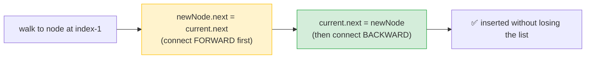

# 🔗 Design Linked List (LeetCode #707) — Complete Foundational Notes

> Notes for becoming a strong software engineer. Easy language, **lots of diagrams**, and an interview *script*. Linked lists are a foundation — let's build the mental model properly.
> Your implementation is **complete and correct** — all edge cases handled. ✅

---

## 🧱 1. What Is a Linked List? (the foundation — read slowly)

An **array** stores items in one continuous block of memory, side by side. A **linked list** stores items as separate **nodes** scattered in memory, where **each node points to the next one** — like a treasure hunt where each clue tells you where the next clue is.

Each **node** holds two things:
1. a **value** (the data), and
2. a **`next`** pointer (the address of the next node).

```
   A single node:
   ┌────────┬────────┐
   │ value  │  next ─┼──▶ (points to the next node, or null if last)
   └────────┴────────┘
```

A full linked list, with a **`head`** pointer marking the start:

```
 head
  │
  ▼
┌────┬───┐    ┌────┬───┐    ┌────┬──────┐
│ 10 │ ●─┼───▶│ 20 │ ●─┼───▶│ 30 │ null │
└────┴───┘    └────┴───┘    └────┴──────┘
 node 1        node 2        node 3 (last → next is null)
```

> 🗺️ Analogy: think of a **train**. Each **coach (node)** holds passengers (value) and is **linked** to the next coach. The **engine (head)** is where you start. To reach coach 3, you walk through coach 1 → coach 2 → coach 3. You **can't teleport** to coach 3 — you must walk the links. That "must walk from the start" is the single most important property of a linked list.

> 💡 Two things we track in this problem: **`head`** (the first node) and **`size`** (how many nodes — so we can bounds-check fast).

---

## ⚖️ 2. Linked List vs Array (the key trade-off)

This is *why* linked lists exist. The big difference is **random access vs insertion/deletion**:

| Operation | 🔗 Linked List | 📦 Array |
|---|---|---|
| **Get by index** | **O(n)** — must walk from head | **O(1)** — jump straight to the index |
| **Add/remove at HEAD** | **O(1)** — just rewire the head pointer | **O(n)** — must shift everything right/left |
| **Add/remove at TAIL** | O(n)* — walk to the end | **O(1)** amortised |
| **Add/remove in middle** | O(n) to walk + **O(1) to rewire** | O(n) — must shift elements |

\* *O(1) if you also keep a `tail` pointer.*

> 💡 **The trade-off in one line:** arrays are great at **reading by index** (O(1)); linked lists are great at **inserting/deleting at the front** (O(1), no shifting). Pick by what your program does most.

> 🎯 Interview line: *"A linked list trades O(1) random access for O(1) insertion and deletion at the head — no shifting of elements. Arrays are the opposite: instant index access, but inserting at the front shifts everything."*

---

## 🧩 3. The Building Blocks (your code)

```javascript
function Node(val) {
    this.value = val;   // the data
    this.next = null;   // pointer to the next node (null = none yet)
}

var MyLinkedList = function() {
    this.head = null;   // first node (null = empty list)
    this.size = 0;      // number of nodes
};
```
> A `Node` is the coach; `MyLinkedList` is the train with a `head` and a passenger count (`size`).

---

## 🔍 4. `get(index)` — Walk to a Position

You **start at the head** and **hop `next` `index` times** to reach the node, then return its value.

```javascript
MyLinkedList.prototype.get = function(index) {
    if (index < 0 || index >= this.size) return -1; // out of bounds → -1
    let current = this.head;
    for (let i = 0; i < index; i++) {
        current = current.next;   // hop forward
    }
    return current.value;
};
```

```
get(2):
 head
  │
  ▼
[10] ──▶ [20] ──▶ [30] ──▶ null
 i=0      i=1      i=2 ◀── stop here, return 30

Start at head (i=0), hop to i=1, hop to i=2 → return 30
```

> ⏱️ **O(n)** — in the worst case you walk the whole list. There's no shortcut; that's the linked-list cost.

---

## ⬅️ 5. `addAtHead(val)` — Insert at the Front (the fast one)

Make a new node, point it at the **old head**, then **move head** to the new node. Just two pointer changes — **O(1)**.

```javascript
MyLinkedList.prototype.addAtHead = function(val) {
    let newNode = new Node(val);
    newNode.next = this.head;  // 1. new node points to old first node
    this.head = newNode;       // 2. head now points to the new node
    this.size++;
};
```

```
addAtHead(5):

Before:   head ──▶ [10] ──▶ [20] ──▶ null

Step 1:   newNode[5].next = head
          [5] ──▶ [10] ──▶ [20] ──▶ null
           ▲
         newNode (head still points to [10] for now)

Step 2:   head = newNode[5]
          head ──▶ [5] ──▶ [10] ──▶ [20] ──▶ null   ✅
```

> ⏱️ **O(1)** — no walking, no shifting. This is the linked list's superpower vs an array (where inserting at front shifts everything).

---

## ➡️ 6. `addAtTail(val)` — Insert at the End

Walk to the **last node** (the one whose `next` is `null`), then attach the new node. Handle the **empty list** specially (new node becomes head).

```javascript
MyLinkedList.prototype.addAtTail = function(val) {
    let newNode = new Node(val);
    if (!this.head) {            // empty list → new node is the head
        this.head = newNode;
        this.size++;
        return;
    }
    let current = this.head;
    while (current.next) {       // walk until the last node
        current = current.next;
    }
    current.next = newNode;      // attach at the end
    this.size++;
};
```

```
addAtTail(30):

Before:   head ──▶ [10] ──▶ [20] ──▶ null
                            ▲ walk here (current.next is null)

After:    head ──▶ [10] ──▶ [20] ──▶ [30] ──▶ null   ✅
```

> ⏱️ **O(n)** — you must walk to the end. (Keeping a `tail` pointer would make this O(1) — see the optimisation note below.)

---

## 🎯 7. `addAtIndex(index, val)` — Insert in the Middle (the tricky one)

The rule: to insert **at** `index`, walk to the node **just before it** (`index - 1`), then rewire two pointers. **Order matters** — connect the new node forward *first*, or you'll lose the rest of the list!

```javascript
MyLinkedList.prototype.addAtIndex = function(index, val) {
    if (index < 0 || index > this.size) return;     // index > size → invalid
    if (index == 0) { this.addAtHead(val); return; } // reuse head insert
    else if (index == this.size) { this.addAtTail(val); return; } // reuse tail insert

    let current = this.head;
    let newNode = new Node(val);
    for (let i = 0; i < index - 1; i++) {   // walk to the node BEFORE index
        current = current.next;
    }
    newNode.next = current.next;  // 1. new node points to what comes after
    current.next = newNode;       // 2. previous node points to the new node
    this.size++;
};
```

```
addAtIndex(1, 15):   (insert 15 at index 1)

Before:   head ──▶ [10] ──▶ [20] ──▶ null
                  index 0   index 1

Step 1: walk to node before index (index-1 = 0):  current = [10]

Step 2: newNode[15].next = current.next   (point 15 → [20] FIRST)
          [15] ──▶ [20]
           
Step 3: current.next = newNode[15]        (now point [10] → 15)
          head ──▶ [10] ──▶ [15] ──▶ [20] ──▶ null   ✅
```

> ⚠️ **Why order matters:** if you did `current.next = newNode` *first*, you'd overwrite the link to `[20]` and **lose the rest of the list**. Always wire the **new node's `next` first**, *then* point the previous node to it.



> 💡 Smart reuse: your code calls `addAtHead` for index 0 and `addAtTail` for index == size — so the special cases are handled by code you already wrote. Clean. ✅

---

## ❌ 8. `deleteAtIndex(index)` — Remove a Node

Walk to the node **before** the target, then **skip over** the target by pointing around it. The skipped node becomes unreferenced and is cleaned up automatically (garbage collected).

```javascript
MyLinkedList.prototype.deleteAtIndex = function(index) {
    if (index < 0 || index >= this.size) return;       // out of bounds
    if (index === 0) this.head = this.head.next;        // remove head
    else {
        let curr = this.head;
        for (let i = 0; i < index - 1; i++) curr = curr.next; // node before target
        curr.next = curr.next.next;                     // skip the target
    }
    this.size--;
};
```

```
deleteAtIndex(1):   (remove index 1)

Before:   head ──▶ [10] ──▶ [15] ──▶ [20] ──▶ null
                  index0   index1   index2

Step 1: walk to node before index (index-1 = 0):  curr = [10]

Step 2: curr.next = curr.next.next   (point [10] PAST [15], straight to [20])
          head ──▶ [10] ─────────▶ [20] ──▶ null   ✅
                          ✗ [15]  ← no longer referenced → garbage collected
```

> 💡 Deleting the head is special (just move `head` forward) — your code handles it with the `index === 0` branch. ✅

---

## ⏱️ 9. Complexity Summary

| Operation | Time | Why |
|---|---|---|
| `get(index)` | **O(n)** | walk from head |
| `addAtHead` | **O(1)** | rewire head only |
| `addAtTail` | **O(n)** | walk to the end (O(1) with a tail pointer) |
| `addAtIndex` | **O(n)** | walk to the position |
| `deleteAtIndex` | **O(n)** | walk to the position |
| **Space** | **O(1)** per op | only a few pointers |

---

## 🔧 10. Built-In (Array) Version — and Why You Shouldn't Use It Here

You *could* back `MyLinkedList` with a JavaScript **array** and built-in methods:
```javascript
var MyLinkedList = function() { this.arr = []; };
MyLinkedList.prototype.get = function(i) { return (i < 0 || i >= this.arr.length) ? -1 : this.arr[i]; };
MyLinkedList.prototype.addAtHead = function(v) { this.arr.unshift(v); };   // built-in
MyLinkedList.prototype.addAtTail = function(v) { this.arr.push(v); };       // built-in
MyLinkedList.prototype.addAtIndex = function(i, v) { if (i>=0 && i<=this.arr.length) this.arr.splice(i, 0, v); };
MyLinkedList.prototype.deleteAtIndex = function(i) { if (i>=0 && i<this.arr.length) this.arr.splice(i, 1); };
```
> ⚠️ This passes, but it **defeats the purpose** — the question is literally *"design a linked list."* Interviewers want to see you build the **node-and-pointer** structure, not wrap an array. Also the complexity flips: `get` becomes O(1), but `addAtHead`/`splice` become O(n) (shifting). Mention it exists, then build the real linked list. *"I could wrap an array with unshift/splice, but the point is to implement the linked list with nodes and pointers, so here it is."*

---

## 🎤 11. The Interview Script — How to Talk Through It

**① Explain the structure first:**
> "A linked list is a chain of nodes, where each node holds a value and a pointer to the next node. I keep a head pointer to the first node and a size counter for bounds checks."

**② Walk each operation with its cost:**
> "get walks from the head to the index — O(n). addAtHead just rewires the head — O(1). addAtTail walks to the end — O(n). addAtIndex walks to the node before the position and rewires two pointers. deleteAtIndex walks to the node before and skips over the target."

**③ Call out the pointer-order gotcha (shows real understanding):**
> "When inserting, I connect the new node's next pointer *forward* first, then point the previous node to it — otherwise I'd lose the rest of the list."

**④ Mention the edge cases you handle:**
> "I handle the empty list, inserting at the head, inserting at the tail when index equals size, deleting the head, and all out-of-bounds checks."

**⑤ Discuss the trade-off vs arrays:**
> "Linked lists give O(1) head insertion with no shifting, but O(n) random access — the opposite of arrays. So they shine when you insert and delete at the front a lot."

> 🎯 **Why this flow wins:** structure → operations + complexity → the pointer-order gotcha → edge cases → array trade-off. Naming the "wire forward first" pitfall and the edge cases proves you understand pointers deeply, not just by memory.

---

## 🟢 12. Likely Follow-up Questions (and answers)

> **Q: "How would you make addAtTail O(1)?"**
> A: "Keep a `tail` pointer to the last node. Then appending is O(1) — I just attach and update tail. I'd need to update tail carefully on deletions of the last node too."

> **Q: "What's a dummy/sentinel head node?"**
> A: "A fake node placed before the real head. It means index 0 isn't a special case — every insert/delete has a 'previous node' (the dummy), so the code is simpler and has fewer edge cases."

> **Q: "Singly vs doubly linked list?"**
> A: "A singly linked list has only `next`. A doubly linked list also has a `prev` pointer, so you can walk backwards and delete a node in O(1) if you already have it — at the cost of extra memory per node."

> **Q: "Why not just use an array?"**
> A: "Arrays are better for random access (O(1)) but worse for front insertion (O(n) shifting). Linked lists are better for O(1) head insert/delete. It depends on the access pattern."

---

## 💎 13. Impressive Words & Phrases

| Instead of saying... | Say this 💪 |
|---|---|
| "The pointer to next" | "The **`next` reference**" |
| "Start of the list" | "The **head** pointer" |
| "Walk through the list" | "**Traverse** the list" |
| "Change the pointers" | "**Rewire / re-link** the pointers" |
| "Fake first node" | "A **dummy / sentinel** node" |
| "Has prev and next" | "A **doubly linked list**" |
| "Add at front is cheap" | "**O(1) head insertion** (no shifting)" |
| "Lost node is cleaned up" | "**Unreferenced** → garbage collected" |

**Power vocabulary:** *node, next/prev reference, head/tail pointer, traversal, pointer rewiring, dummy/sentinel node, singly vs doubly linked, O(1) head insertion, contiguous vs linked memory, garbage collection.*

> 🌶️ Bonus flex — **the dummy/sentinel node:** *"To remove all the special-casing for the head, I'd use a dummy node before the head. Then every node — even the first real one — has a predecessor, so insert and delete use one uniform code path with no `index === 0` branch. It's a common trick that makes linked-list code cleaner and less bug-prone."* Knowing the sentinel technique signals you've worked with linked lists beyond the basics.

---

## ⏱️ 14. Quick Revision (read 5 min before interview)

> **Linked list = chain of nodes**, each with a **value** + a **`next`** pointer. Track **head** + **size**.
>
> **Core difference from array:** O(n) random access, but **O(1) head insert/delete** (no shifting). Array is the opposite.
>
> **Operations:**
> - `get(i)`: walk from head i times → **O(n)**
> - `addAtHead`: newNode.next = head; head = newNode → **O(1)**
> - `addAtTail`: walk to last node, attach → **O(n)** (O(1) with tail pointer)
> - `addAtIndex`: walk to **index-1**, then `newNode.next = curr.next; curr.next = newNode` → **O(n)**
> - `deleteAtIndex`: walk to **index-1**, then `curr.next = curr.next.next` → **O(n)**
>
> **⚠️ Pointer order on insert:** connect the **new node forward FIRST**, then link the previous node — or you lose the rest of the list.
>
> **Edge cases:** empty list, index 0 (head), index == size (tail), delete head, out of bounds.
>
> **Pro trick:** a **dummy/sentinel head** removes the index-0 special case. A **tail pointer** makes addAtTail O(1).
>
> **Golden line:** *"A linked list is nodes chained by next pointers. I track head and size. Inserting means rewiring two pointers — new node forward first, then the previous node — and the head/tail/empty cases are the edge cases to handle. It trades O(n) access for O(1) head insertion."*

---

### ✅ Practice checklist
- [ ] Draw a 3-node list on paper with head and next pointers
- [ ] Draw addAtHead, addAtIndex, deleteAtIndex step-by-step (the rewiring)
- [ ] Explain *why* you wire the new node's `next` first
- [ ] List all edge cases (empty, head, tail, out of bounds) and where each is handled
- [ ] (Stretch) add a `tail` pointer to make addAtTail O(1)
- [ ] (Stretch) rewrite using a dummy/sentinel head to remove the index-0 branch
- [ ] Next linked-list problems: Reverse Linked List (#206), Middle of the List (#876), Merge Two Lists (#21)

Your implementation is complete and correct — now master the *diagrams* and the pointer-order gotcha, because linked-list questions are really testing whether you can manipulate pointers confidently. This foundation unlocks a whole category of problems. 🚀
