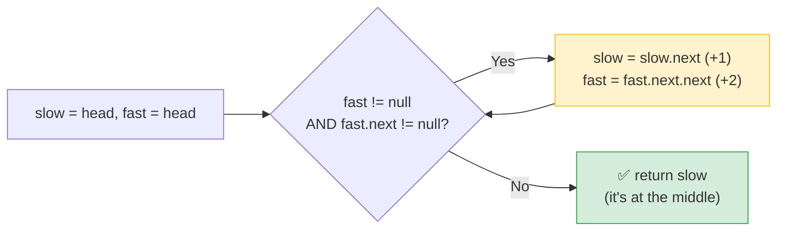

# 🐢🐇 Middle of the Linked List (LeetCode #876) — Complete Notes

> Notes for becoming a strong software engineer. Easy language, clear diagrams, and an interview *script*.
> Your solution is **correct and optimal** — the elegant **fast & slow pointer** technique. ✅

---

## 🤔 1. What Is This Question Asking? (quick)

You're given a linked list. Return the **middle node**. If the list has an **even** number of nodes (so there are *two* middles), return the **second** one.

**Examples:**
```
[1, 2, 3, 4, 5]      → middle is 3        (5 nodes, single middle)
[1, 2, 3, 4, 5, 6]   → middles are 3 & 4 → return 4   (even → second middle)
```

> 🧩 Plain words: *"Walk to the centre of the list and return that node. For an even list, pick the one just past the centre."*

> ⚠️ Note: it returns the **node** (from which the rest of the list follows), not just its value.

---

## 🐢 2. Brute Force First (count, then walk)

**Naive idea:** walk once to **count** the length `n`, then walk again to the **`n/2`-th** node.
```javascript
var middleNode = function(head) {
    let n = 0;
    let curr = head;
    while (curr) { n++; curr = curr.next; }     // pass 1: count length

    curr = head;
    for (let i = 0; i < Math.floor(n / 2); i++)  // pass 2: walk to the middle
        curr = curr.next;
    return curr;
};
```
> ⚠️ This works and is O(n) time, O(1) space — but it needs **two passes** through the list. (You could also dump all nodes into an array and index the middle, but that's O(n) **space**.)

> 🎯 Say out loud: *"I could count the length first, then walk halfway — two passes. But there's a one-pass trick using two pointers at different speeds."*

---

## ✅ 3. Your Optimal Solution (fast & slow pointers — one pass)

```javascript
var middleNode = function(head) {
    let slowPoint = head;   // moves 1 step at a time
    let fastPoint = head;   // moves 2 steps at a time

    while (fastPoint != null && fastPoint.next != null) {
        slowPoint = slowPoint.next;        // +1
        fastPoint = fastPoint.next.next;   // +2
    }
    return slowPoint;       // when fast reaches the end, slow is at the middle
};
```

**This is the textbook optimal answer** — the **fast & slow pointer** technique (also called **tortoise & hare**). Two pointers start together; **slow moves 1 step**, **fast moves 2 steps**.

> 💡 **The key insight:** fast moves **twice as fast** as slow. So when **fast reaches the end** (it has travelled the full list), **slow has travelled only halfway** — meaning slow is sitting exactly on the **middle**. You find the middle in **one pass without ever counting** the length.

> ⚡ **Complexity:** **O(n) time** (one pass), **O(1) space** (two pointers). Optimal.

> 🏃 Analogy: two runners on a track, one twice as fast. The moment the **fast runner finishes** the lap, the **slow runner is at the halfway mark.** That's exactly how slow lands on the middle.

---

## 🔍 4. How It Works — Step by Step (with diagrams)

### Odd length — `[1, 2, 3, 4, 5]` → middle `3`
```
Start:   [1] → [2] → [3] → [4] → [5] → null
         S,F

Move 1:  [1] → [2] → [3] → [4] → [5] → null
               S           F

Move 2:  [1] → [2] → [3] → [4] → [5] → null
                     S                 F
         (fast is on [5], fast.next is null → STOP)

return slow = [3]   ✅  (the middle)
```

### Even length — `[1, 2, 3, 4, 5, 6]` → second middle `4`
```
Start:   [1] → [2] → [3] → [4] → [5] → [6] → null
         S,F

Move 1:  [1] → [2] → [3] → [4] → [5] → [6] → null
               S           F

Move 2:  [1] → [2] → [3] → [4] → [5] → [6] → null
                     S                 F

Move 3:  [1] → [2] → [3] → [4] → [5] → [6] → null
                           S                       F = null
         (fast became null → STOP)

return slow = [4]   ✅  (the SECOND of the two middles 3 & 4)
```



---

## 🔑 5. Why BOTH Loop Conditions Matter (the subtle part)

The condition is `while (fastPoint != null && fastPoint.next != null)`. **Both checks are essential**, and each handles a different case:

| Check | Handles | Why |
|---|---|---|
| `fast != null` | **Even**-length lists | After the last node, fast lands exactly on `null` — stop before reading `fast.next`. |
| `fast.next != null` | **Odd**-length lists | Fast lands on the last node; `fast.next` is `null`, so we stop before `fast.next.next` crashes. |

> ⚠️ If you only checked one, you'd hit a crash: `fast.next.next` throws if `fast` or `fast.next` is `null`. Checking both means `fast.next.next` is always safe to read. **Order matters too** — `fast != null` is checked first (short-circuit), so `fast.next` is only read when `fast` exists.

> 🎯 Interview line: *"I check both fast and fast.next before moving, because fast jumps two steps — for even lists fast becomes null, for odd lists fast.next becomes null. Both guards prevent a null-pointer crash on fast.next.next."*

---

## 🔧 6. Built-In Function?

There's **no JavaScript built-in** for this — linked lists aren't a native JS data structure, so you can't `.something()` your way to the middle. The fast/slow pointer approach *is* the clean answer. (You could copy nodes into an array and index the middle, but that's O(n) space — worse than the two-pointer O(1).)

---

## 🎤 7. The Interview Script — How to Talk Through It

Narrate in this order — brute force first, then the one-pass trick:

**① Restate:**
> "I need the middle node of the list, and for an even-length list, the second of the two middle nodes."

**② Brute force first:**
> "The simple way is two passes — count the length, then walk to the n/2-th node. Works, but two traversals."

**③ Propose the optimal (the insight):**
> "I can do it in one pass with two pointers at different speeds. Slow moves one step, fast moves two. Since fast goes twice as fast, when fast reaches the end, slow is exactly at the middle."

**④ Complexity:**
> "One pass — O(n) time, O(1) space, just two pointers, no counting."

**⑤ Mention the guard (shows care):**
> "The loop checks both fast and fast.next before stepping, so fast.next.next never crashes — fast becomes null on even lists, fast.next becomes null on odd lists. This condition also naturally returns the second middle for even lengths."

**⑥ Code it, narrating; then verify:**
> "Trace [1,2,3,4,5]: slow goes 1→2→3, fast goes 1→3→5 and stops. Return 3. For [1,2,3,4,5,6], slow ends on 4, the second middle. Correct."

> 🎯 **Why this flow wins:** brute force → one-pass insight → complexity → the null-guard reasoning → verify. Explaining *why both guards are needed* proves you understand the pointer mechanics, not just the pattern.

---

## 🟢 8. Likely Follow-up Questions (and answers)

> **Q: "Why does slow end up exactly at the middle?"**
> A: "Fast travels twice the distance of slow. When fast has covered the whole list (n steps), slow has covered n/2 steps — so slow is at the halfway point, the middle."

> **Q: "How do you return the *first* middle instead of the second for even lists?"**
> A: "Change the loop guard to stop one step earlier — `while (fast.next && fast.next.next)`. Then slow lands on the first of the two middles."

> **Q: "Where else is the fast/slow technique used?"**
> A: "**Cycle detection** — Floyd's algorithm. If the list has a loop, the fast pointer eventually laps the slow one and they meet. Same two-speed idea, different goal. It's also used to find the n-th node from the end."

> **Q: "Why not just use the two-pass count method?"**
> A: "Both are O(n) time and O(1) space, but the fast/slow version is a single elegant pass and doesn't need the length up front — useful when you can't easily pre-count."

---

## 💎 9. Impressive Words & Phrases

| Instead of saying... | Say this 💪 |
|---|---|
| "One slow, one fast pointer" | "**Fast & slow pointers** (tortoise & hare)" |
| "Move two at a time" | "A pointer at **2× speed**" |
| "Go through once" | "A **single-pass** traversal" |
| "Check it won't crash" | "**Null guards** before dereferencing" |
| "Two middles, pick second" | "Returns the **second median node**" |
| "Find loops with it" | "**Floyd's cycle detection**" |
| "Two variables only" | "**O(1) auxiliary space**" |

**Power vocabulary:** *fast & slow pointers, tortoise and hare, two-pointer, single-pass, 2× traversal speed, null guard / short-circuit, Floyd's cycle detection, O(1) auxiliary space, dereferencing safety.*

> 🌶️ Bonus flex — **"fast/slow is a whole family":** *"The two-speed pointer idea solves a family of linked-list problems in one pass with O(1) space — finding the middle, detecting a cycle with Floyd's algorithm, finding the cycle's start, and finding the n-th node from the end. The trick is choosing the right speeds and start positions for the goal."* Naming the broader family shows you see the pattern, not just this one problem.

---

## ⏱️ 10. Quick Revision (read 5 min before interview)

> **Problem:** return the **middle node**; for even length, the **second** middle.
>
> **Brute force:** count length, then walk to n/2 → **two passes**, O(n) time, O(1) space.
>
> **⭐ Optimal (fast & slow):** slow +1, fast +2. When fast reaches the end, slow is at the middle. **One pass, O(n) time, O(1) space.**
>
> **Why:** fast goes 2× as far → slow is at half when fast finishes.
>
> **Loop guard:** `while (fast != null && fast.next != null)` — `fast != null` for **even**, `fast.next != null` for **odd**; both prevent a crash on `fast.next.next`. This guard returns the **second** middle for even lists.
>
> **First middle instead:** guard `while (fast.next && fast.next.next)`.
>
> **Same technique:** Floyd's **cycle detection**, n-th from end.
>
> **Golden line:** *"Two pointers from the head — slow moves one step, fast moves two. When fast hits the end, slow is at the middle, because fast covers twice the distance. One pass, O(1) space, with null guards so fast.next.next never crashes."*

---

### ✅ Practice checklist
- [ ] Re-solve the fast/slow version from scratch
- [ ] Write the two-pass count brute force and explain the extra traversal
- [ ] Trace [1,2,3,4,5] AND [1,2,3,4,5,6] on paper (watch slow vs fast)
- [ ] Explain *why both* loop guards are needed (even vs odd, crash safety)
- [ ] Modify it to return the *first* middle for even lists
- [ ] (Stretch) Linked List Cycle #141 — same fast/slow technique (Floyd's)
- [ ] Practise the interview script (brute → fast/slow → guard reasoning)

Your solution is already optimal — now master *why* fast/slow lands on the middle and *why both guards matter*, because this technique unlocks cycle detection and a whole family of linked-list problems. 🚀
