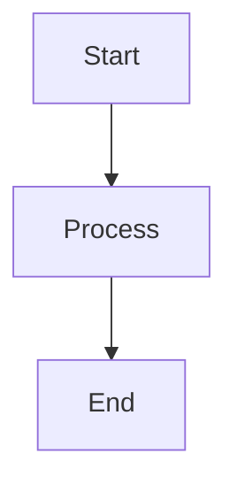

# NayanDevLab — Docs Site

A custom documentation website that turns the markdown notes in this repo into a polished, searchable, themed docs site.

**Live stack:** Next.js 16 (App Router) · React 19 · TypeScript · Tailwind CSS v4

---

## Quick Start

```bash
cd web-version
npm install
npm run dev        # opens at http://localhost:3000
```

That's it. The `predev` script automatically builds the search index before the server starts. If you add new `.md` files, restart the dev server to pick them up.

---

## How It Works — The Big Picture

```
my-learning-notes/              ← your markdown notes live HERE
├── backend/
│   ├── express/
│   │   └── event-loop-notes.md     ← this file...
│   └── authentication/
├── databases/
├── dsa/
│
└── web-version/                ← the Next.js site lives HERE
    └── src/
```

**The key idea:** Your `.md` files live in the PARENT folder (one level up from `web-version/`). The site reads them at build time using Node.js `fs` — no copy step, no CMS, no API. Each `.md` file becomes a page on the site.

### File → URL mapping

```
backend/express/event-loop-notes.md
    ↓
http://localhost:3000/backend/express/event-loop-notes
```

The folder path becomes the URL. Simple.

---

## How a Markdown File Becomes a Page

Here's the journey of a `.md` file from disk to browser, step by step:

```
┌─────────────────────────────────────────────────────────────┐
│  1. BUILD TIME (server)                                     │
│                                                             │
│  content.ts reads all .md files from ../                    │
│       ↓                                                     │
│  Builds nav tree (sidebar data) from folder structure       │
│       ↓                                                     │
│  generateStaticParams() lists all slugs for Next.js         │
│       ↓                                                     │
│  For each page:                                             │
│    - gray-matter parses frontmatter (if any)                │
│    - Shiki highlights all code blocks (dark + light)        │
│    - Headings extracted for the TOC                         │
│       ↓                                                     │
│  Data passed to React components                            │
└─────────────────────────────────────────────────────────────┘
                          ↓
┌─────────────────────────────────────────────────────────────┐
│  2. RENDER (client)                                         │
│                                                             │
│  react-markdown parses the .md body                         │
│       ↓                                                     │
│  Custom component overrides kick in:                        │
│    - Code fences → CodeBlock (header bar + copy + syntax)   │
│    - Blockquotes with emoji → Callout boxes                 │
│    - ```mermaid → MermaidDiagram                            │
│    - Tables, checklists → styled versions                   │
│       ↓                                                     │
│  Rendered inside the 3-column layout                        │
│  (sidebar | article | TOC)                                  │
└─────────────────────────────────────────────────────────────┘
```

---

## Folder Structure

```
web-version/
├── public/
│   └── search-index.json        ← auto-generated, don't edit
│
├── scripts/
│   └── generate-search-index.ts ← builds the search JSON
│
├── design/                      ← original design exports (reference only)
│   ├── NayanDevLab Docs.dc.html
│   └── CodeBlock.dc.html
│
└── src/
    ├── app/                     ← Next.js pages
    │   ├── layout.tsx           ← root layout (fonts, theme provider)
    │   ├── page.tsx             ← landing page (/)
    │   ├── globals.css          ← all styles + design tokens
    │   └── [...slug]/           ← catch-all route for every note
    │       ├── page.tsx         ← server component (reads .md, highlights code)
    │       └── markdown-body.tsx← client component (renders markdown)
    │
    ├── components/              ← reusable UI components
    │   ├── header.tsx           ← top bar (brand, search, theme toggle)
    │   ├── sidebar.tsx          ← left nav (collapsible folder tree)
    │   ├── toc.tsx              ← right "On this page" (scroll spy)
    │   ├── search.tsx           ← ⌘K search modal (fuse.js)
    │   ├── code-block.tsx       ← code with header bar + copy + syntax
    │   ├── callout.tsx          ← colored callout boxes (💡 ⚠️ ✅ etc.)
    │   ├── mermaid.tsx          ← mermaid diagram renderer
    │   ├── pagination.tsx       ← prev/next cards at bottom
    │   ├── theme-provider.tsx   ← dark/light theme context
    │   ├── theme-toggle.tsx     ← the sun/moon button
    │   └── mobile-sidebar.tsx   ← hamburger drawer for small screens
    │
    └── lib/                     ← core logic (no UI)
        ├── content.ts           ← reads .md files, builds nav tree, extracts headings
        ├── process-markdown.ts  ← pre-highlights code blocks with Shiki
        └── shiki.ts             ← Shiki highlighter with custom dark/light themes
```

---

## Important Files — What Each One Does

### `src/lib/content.ts` — The Content Engine

This is the most important file. It does everything related to reading your notes:

- **`getNavTree()`** — Walks the parent directory (`../backend/`, `../databases/`, `../dsa/`) and builds a nested tree structure used by the sidebar. Folders become groups, `.md` files become leaves.
- **`getAllSlugs()`** — Returns every page's URL slug. Used by `generateStaticParams()` to tell Next.js which pages to build.
- **`getNoteBySlug(slug)`** — Reads a single `.md` file, parses frontmatter with gray-matter, returns the title and body.
- **`extractHeadings(markdown)`** — Pulls `##` and `###` headings from the markdown for the TOC.
- **`getPrevNext(slug)`** — Finds the previous and next note in sidebar order for pagination.

**If you add a new content folder** (e.g. `devops/`), add it to the `CONTENT_DIRS` array at the top of this file and in `scripts/generate-search-index.ts`.

### `src/app/[...slug]/page.tsx` — The Note Page

This is a **server component** that runs at build time for every note. It:
1. Reads the `.md` file via `getNoteBySlug()`
2. Pre-highlights all code blocks with Shiki (both dark and light themes)
3. Extracts headings for the TOC
4. Passes everything to the client-side `MarkdownBody` component

### `src/app/[...slug]/markdown-body.tsx` — The Markdown Renderer

This is a **client component** that takes the raw markdown string and renders it. It uses `react-markdown` with custom component overrides:

| Markdown element | What it renders |
|---|---|
| ` ```lang ` code fences | `CodeBlock` component (header + copy + syntax highlighting) |
| ` ```mermaid ` | `MermaidDiagram` component |
| `> 💡 text` blockquotes with emoji | `Callout` component (colored box) |
| `## Heading` | Heading with anchor link |
| Tables, checklists, etc. | Styled HTML via CSS classes |

### `src/app/globals.css` — All Styles

Contains everything:
- **Design tokens** (CSS variables) for dark and light mode
- **Prose styles** for rendered markdown (headings, paragraphs, lists, tables, etc.)
- **Component styles** (code blocks, callouts, sidebar, search modal, etc.)

### `scripts/generate-search-index.ts` — Search Index Builder

Runs automatically before `npm run dev` and `npm run build`. Reads every `.md` file, extracts title + snippet, and writes `public/search-index.json`. The search modal fetches this file on first open.

---

## How to Add Content

### Adding a new note

1. Create a `.md` file anywhere inside `backend/`, `databases/`, or `dsa/`
2. Start with a `# Heading` — this becomes the page title
3. Restart the dev server (`npm run dev`)

The file automatically gets a URL based on its path, appears in the sidebar, and becomes searchable.

### Adding a new section (folder)

1. Create a new folder at the root level (e.g. `devops/`)
2. Add it to `CONTENT_DIRS` in `src/lib/content.ts`:
   ```typescript
   const CONTENT_DIRS = [
     "backend",
     "databases",
     "dsa",
     "devops",     // ← add here
   ];
   ```
3. Also add it in `scripts/generate-search-index.ts` (same array)
4. Restart the dev server

---

## Markdown Features You Can Use

Your notes support all of these:

```markdown
# Title (becomes page title)
## Section (appears in TOC)
### Subsection (appears in TOC, indented)

**bold**, *italic*, `inline code`

> 💡 This becomes a blue "Tip" callout box
> ⚠️ This becomes an amber "Warning" callout
> ✅ This becomes a green "Key Insight" callout
> 🎯 This becomes a purple "Key Point" callout
> ⚡ This becomes a teal "Complexity" callout
> 🌶️ This becomes an orange "Bonus" callout

- [ ] Unchecked item (custom checkbox)
- [x] Checked item

| Column A | Column B |
|----------|----------|
| data     | data     |
```

### Code blocks with syntax highlighting

````markdown
```javascript
function hello() {
  return "world";
}
```
````

### Highlighted lines (optional)

Add `{lineNumbers}` after the language to emphasize specific lines:

````markdown
```javascript {3}
function hello() {
  const msg = "world";
  return msg;            ← line 3 glows
}
```

```typescript {1,4-6}    ← line 1 and lines 4 through 6
interface User {
  name: string;
  email: string;
  role: "admin" | "user";
  createdAt: Date;
  updatedAt: Date;
}
```
````

This is optional — code blocks without `{...}` work exactly the same as before. The `{...}` part is ignored by GitHub, so your `.md` files still render normally on GitHub.

### Mermaid diagrams

````markdown

````

---

## Theming

The site has dark (default) and light mode. All colors are CSS variables in `globals.css`.

- **Dark tokens** → `:root { ... }`
- **Light tokens** → `[data-theme="light"] { ... }`

The toggle sets `data-theme="light"` on `<html>` and saves to `localStorage`.

To change a color site-wide, edit the CSS variable — every component uses them.

---

## Key Libraries

| Library | What it does | Where it's used |
|---------|-------------|-----------------|
| `react-markdown` | Parses markdown to React | `markdown-body.tsx` |
| `remark-gfm` | Tables, checklists, strikethrough | `markdown-body.tsx` |
| `shiki` | Syntax highlighting (custom themes) | `shiki.ts` |
| `mermaid` | Renders flowcharts/diagrams | `mermaid.tsx` |
| `fuse.js` | Fuzzy search across notes | `search.tsx` |
| `gray-matter` | Parses YAML frontmatter | `content.ts` |

---

## npm Scripts

| Command | What it does |
|---------|-------------|
| `npm run dev` | Builds search index, then starts dev server |
| `npm run build` | Builds search index, then production build |
| `npm run start` | Serves production build |
| `npm run generate-search` | Manually rebuilds `public/search-index.json` |
| `npm run lint` | Runs ESLint |
